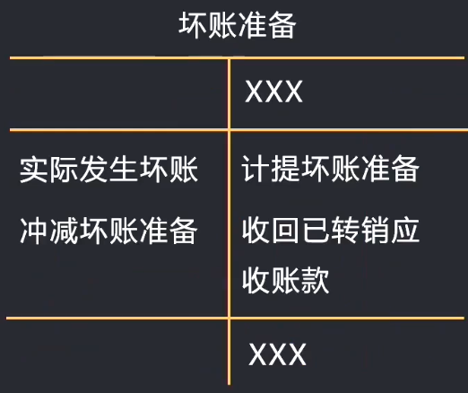

# 会计基础

## 概述

### 会计概念

​	会计是以**货币**为主要计量单位，采用**专门方法和程序**，对企业和行政、事业单位的经济活动进行完整的、连续的、系统的**核算**和**监督**，以**提供经济信息**和**反应受托责任履行情况为主要目的**的**经济管理活动**。

会计提供的经济信息最终产品是**财务会计报告**：

1. 资产负债表
2. 利润表
3. 所有者权益变动表
4. 现金流量表
5. 财务报表附注

### 会计职能

* 基本职能
  * 核算 -- 确认、计量、记录、报告；核算是监督的基础
  * 监督 -- 真实性、完整性、合法性、合理性；监督是核算的保障
* 拓展职能
  * 预测经济前景
  * 参与经济决策
  * 评价经营业绩

### 会计目标

* 受托责任观

  反应管理层受托责任的履行情况

* 决策有用观

  有助于财务报告使用者做出经济决策

### 会计基本假设

* 会计主体
* 持续经营
* 会计分期
* 货币计量

### 会计基础

会计**核算**的基础，包括**权责发生制**和**收付实现制**。

### 会计信息质量要求

* 可靠性

  要求企业应当以**实际发生**的交易或事项为依据进行核算，以保证会计信息**真实可靠、内容完整**。

* 重要性

* 谨慎性

  企业对交易或事项进行核算时应该保持应有的谨慎，不应**高估**资产或者收益、**低估**负债或者费用。

* 实质重于形式

  经济实质 > 法律形式

* 及时性

* 可比性

* 可理解性

## 会计基础

### 会计要素

指根据交易或事项的经济特征所确定的财务会计对象和基本分类。

会计要素按照性质分：

* 资产

  指企业**过去的**交易或事项形成的、由企业**拥有**或**控制**的、预期会给企业**带来经济利益的资源**。

* 负债

  指企业**过去的**交易或事项形成的，预期会导致**经济利益**流出企业的**现时义务**。

* 所有者权益

  指企业**资产扣除负债**后由所有者享有的**剩余权益**。公司的所有者权益又被称之为**股东权益（净资产）**。

* 收入

* 费用

* 利润

### 会计要素的计量属性

​	会计计量属性是指会计要素的数量特征或外在表现形式，反应了会计要素金额的确定基础，主要包括**历史成本、重置成本、可变现净值、公允价值**。

* 历史成本

  又称为实际成本，是指为**取得或制造**某项财务物质时所**实际支付**的现金。

* 公允价值

  是指市场参与者在计量日发生的**有序交易**中，出售一项资产所能收到或转移一项负债所需要支付的价格。

* 可变现净值

  在正常生产经营过程中，以**预计售价**减去**进一步加工成本**和**预计销售费用**以及**相关税费**后的**净值**。

* 重置成本

  又称现行成本，是指在当期市场条件下，**重新取得**同样一项资产所需要支付的现金。

* 现值

  对未来现金流量以恰当的折现率进行折现后的价值，是考虑**资金时间价值**的一种计量属性。

### 会计等式

揭示**会计要素之间内在联系**的数学表达式。

1. 财务状况等式

   资产 = 负债 + 所有者权益

   反映企业**某一特定时间点**资产、负债和所有者权益三者间**平衡关系**的会计等式，是**基本会计等式及静态会计等式**。

   基本等式是**复试记账法**的理论基础，也是编制**资产负债表**的依据。

2. 经营成果等式

   收入 - 费用 = 利润

   用于反映企业**一定时期**收入、费用和利润间恒等关系的会计等式，又叫**动态会计等式**，反映了利润的实现过程，是**编制利润表的依据**。

3. 动静结合等式

   资产 = 负债 + 所有者权益 + 收入 - 费用

### 会计科目

会计科目是指对会计要素的具体内容进行分类核算的项目。

按反映的经济内容分类

| 科目类别       | 会计要素         | 常见科目                                                     |
| -------------- | ---------------- | ------------------------------------------------------------ |
| 资产类         | 资产             | 银行存款、原材料、库存商品、固定资产、应收账款               |
| 负债类         | 负债             | 应付账款、应交税费、应付股利、短期借款                       |
| 所有者权益类   | 所有者权益、利润 | 实收资本（股本）、资本公积、盈余公积、利润分配、其他综合收益、本年利润 |
| 损益类         | 收入             | 主营业务收入、其他业务收入                                   |
|                | 利得             | 营业外收入、资产处置损益、公允价值变动损益、投资收益         |
|                | 费用             | 主营业务成本、其他业务成本、销售费用、管理费用、财务费用、税金及附加、资产减值损失、信用减值损失 |
|                | 损失             | 营业外支出、资产处置损益、公允价值变动损益、投资收益         |
| 成本类         | 资产             | 生产成本、制造费用、研发支出、合同取得成本、合同履约成本     |
| 共同类（了解） | 资产+负债        | 资金清算往来、内部往来                                       |

### 会计账户

​	会计账户是根据会计科目设置的，具有一定**格式**的**结构**，用于反应会计要素的增减变动情况及其结果的**载体**。

#### 记账方法

**资产、成本、费用借增贷减**

**负债、所有者权益、收入贷增借减**

* 记账规则

  **有借必有贷，借贷必相等**

  ​	一项业务，记入一个（几个）账户的借方，同时也要记入另一个（几个）账户的贷方，反过来也同样成立。

  记入借方金额的合计数**必须等于**记入贷方金额的合计数。

* 会计分录

  是对每项经济业务列示出借、贷的账号名称及其金额的一种记录。

  分类要素：

  * 相互对应的科目
  * 借贷方向
  * 金额

  如：

  借：原材料 1000

  ​	贷：银行存款 1000

  **格式固定、借贷一定要错开写，先借后贷，金额后面不能带单位**

* 记账凭证

  是会计分录的载体

* 编制分录五部法

  * 分析业务、明确涉及的会计科目
  * 确定科目的类别
  * 判断科目的增减，以及增减的金额
  * 确定科目方向是借还是贷
  * 编制会计分录，并检查是否符合记账规则

### 会计凭证

​	会计凭证是指记录经济业务发生或者完成情况的书面证明，是**登记账簿的依据**。分为**原始凭证**和**记账凭证**。

​	记账凭证是指会计人员根据审核无误的原始凭证，按照经济业务的内容加以归类，并据此确定会计分录后填制的会计凭证，是登记账簿的直接依据。

### 会计账簿

​	是指由一定格式的账页组成的，以经济审核的会计凭证为依据、全面、系统、连续地记录各项经济业务和会计事项的簿籍。

## 资产

### 货币资金

是企业的一种金融资产，是企业生产经营过程中处于货币形态的资产，包括

* 库存现金

  * 现金的使用制度

  * 现金限额

  * 现金收支的规定

    * 单位现金收入**应当于当日**送存开户银行
    * 单位支付现金，**不得**从单位的现金收入中**直接支付**（即**坐支**）
    * 单位从开户行提取现金时，应当写明用途

  * 库存现金清查

    

* 银行存款

  * 银行存款总账

  * 银行存款日记账

    * 银行存款的核对

      银行存款日记账应定期与银行对账单核对，至少每月核对一次。

      银行存款日记账与银行存款对账单不一致时，会产生**未达账项**，需要通过**银行存款余额调节表**来调整。

* 其他货币资金

  其他货币账务处理同库存现金、银行存款。

  其他货币资金包括银行汇票存款、银行本票存款、信用卡存款、信用证保证金存款、存出投资款和外埠存款等。

### 应收及预付款项

应收及预付款项是指企业在日常生产经营过程中发生的各项债权，包括应收款项和应付款项。

* 应收账款

  * 应收账款减值

    企业的各项应收款项，可能会应债务人拒付、破产、死亡等信用缺失原因而使部分或全部无法收回。这类无法收回的应收款项通常称为**坏账**

    应收款项减值核算方法

    * 直接转销法（小企业会计准则）

      采用直接转销法时，日常核算中应收款项可能发生的坏账损失不进行会计处理，只有在实际发生坏账时，才作为坏账损失计入当期损益。

    * 备抵法（企业会计准则）

      备抵法是采用一定的方法按期确定预期信用损失计入当前损益，作为坏账准备，带坏账损失实际发生时，冲销已计提的坏账准备和相应的应收款项。

      需要用到以下会计科目：

      * 信用减值损失 （费用类）
      * 坏账准备 （资产类-备抵科目）**借减贷增**

    **坏账准备的增减变动与应收账款的增减变动正好相反**

    **应收账款账面价值 = 应收账款余额 - 坏账准备**

    

    **坏账准备期末余额 = 应收账款期末余额 * 计提比例**

    **计提坏账准备 = 坏账准备期末余额 - 坏账准备期初余额**

* 应收票据 （资产类）

  * 商业汇票
    * 商业承兑汇票
    * 银行承兑汇票

* 应收股利 （资产类）

* 应收利息（资产类）

* 其他应收款（资产类）

  指企业除应收票据、应收账款、预付账款、应收股利和应收利息以外的其他各种应收及暂付款项。

  * 应收的各种**赔款、罚款**
  * 应收的**出租包装物租金**
  * 应向**职工**收取的各种**垫付款项**
  * **存出保证金**，如租入包装物支付的押金
  * **其他**各种应收、暂付款项

* 应付账款

### 交易性金融资产

​	指以公允价值计量且其变动**计入当期损益**的金融资产。它是企业为了**近期内出售而持有**的金融资产。包括以**赚取差价未目的**从二级市场购入的**股票、债权和基金**等。

* 初始计量

  * 科目设置

    用于核算企业分类为以公允价值计量且其变动计当期损益的金融资产。属于资产类科目，借增贷减。企业应分别设置**成本，公允价值变动**明细对交易性金融资产进行核算。

    **交易性金融资产--成本（资产类）**核算取得该金融资产时的公允价值。

* 后续计量

  * 科目设置

    **交易性金融资产--公允价值变动（资产类）**核算取得该金融资产后的公允价值变动。

    **公允价值变动损益：**用于核算企业交易性金融资产等公允价值变动而形成的计入当期损益的利得或损失。属于**损益类科目，贷增借减**，期末转入本年利润无余额。
  
* 处置

  * 科目设置
    * **投资收益**：用于核算企业交易性金融资产等在期间内取得的投资收益以及出售交易性金融资产等实现的利得或损失。属于**损益类科目，贷增借减**，期末转入本年利润无余额。
  

