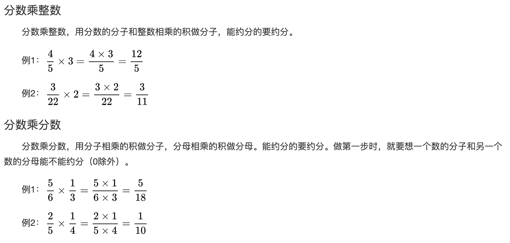
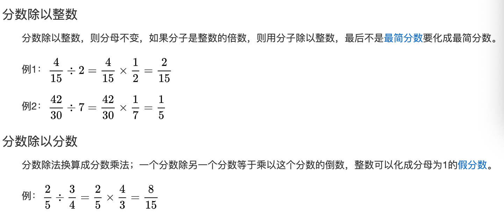

### 开场白

同学们好，我是肖老师，欢迎大家来到CSP-J数学基础部分的学习。
在正式开始学习CSP-J数学基础前，老师必须给同学们补充一下这个部分的前置知识，因为咱们这个课程是面向四年级的小朋友的，而CSP-J数学基础部分的内容对于这个阶段的孩子们是有点超纲的；如果你现在是四年级或五年级的小朋友，为了让你能够顺利的进入CSP-J的学习，你一定要跟着老师学好这个部分的前置知识。
首先，我们来学习一下分数。

### 课程内容

---

#### 导入

那什么是分数、分数有什么作用呢？我们什么时候会用到分数呢？请带着这些问题，进入今天的学习。

与**分数**相对应的是**整数**，你一定学过整数，比如0、1、2、3、4、5、6、7、8、9....等等，这些都是整数，它主要是来帮助我们计数用的，比如一个圆、两个圆、三个圆等。

那如果我们将一个圆平均分成多份，每一份占整个圆的多少该怎么表示呢？

这个时候，我们就要用到分数这个数学工具了

---

#### 输入新知识点

* 定义

  分数是指整体的一部分，表现形式为一个整数与另一个非0整数的比。

  比如这个大圆被平均分成了两份，其中黄色部分占整个圆的$\frac12$，这里的$\frac12$就是一个分数，表现形式是两个整数1和2的比。

  这个圆呢，被平均分成了3份，黄色部分占整个圆的$\frac13$；同样最后一个圆被平均分成了4份，黄色部分占整个圆的$\frac24$

  这里的$\frac12、\frac13、\frac24$都是分数，表示的都是部分占整体的多少；所以当我们需要表示整体的一个部分占整体的多少的时候，我们就要用到分数。

* 分数的组成

  我们再来看看，分数是由哪几个部分组成的呢？

  比如$\frac12$，1被称为分子、2被称为分母、中间的横线叫做分数线

  我们把分数的表现形式一般化后，可以这样表示$\frac ab$，$a和b$都是整数，其中$b$不等于0，即分母是不能为0的；比如我们这样写$\frac10$就不对，这样分母就是0了

  当$a=1，b=2$时，表示的就是$\frac12$

  当$a=1，b=3时，表示的就是$$\frac13$

  同学们要逐渐熟悉这种$\frac ab$的表示方法，这里的$a和b$都不是一个确定的数，它们是变量；在这个地方，$a$可以表示任何一个整数，而$b$可以表示任何一个非0的整数；变量这个概念很重要，我们在后期学函数以及下一个阶段学C++程序设计时，会经常适用它。

* 分数和除法的关系

  好了，我们知道了分数是由分子、分母和分数线组成的，那么我们再来看看，分数和除法有什么关系呢？

  比如还是刚刚那个问题，把一个圆平均分成两份，每份占多少？

  这个问题，我们用除法来表示，就是$1÷2$

  如果用分数来表示呢，就是$\frac12$

  看出来了吗？

  这里的被除数1和这个分子是等价的

  这里的除数2和这个分母是等价的

  这里的除号和这个分数线是等价的

  即：

  被除数等价与分子

  除数等价于分母

  除号等价于分数线

  商等价于分数值

  既然分数和除法有这样的等价关系，咱们以后在分数上想不明白的事情，就想想它对应的除法是怎样的，这样就能帮助我们来理解分数。

  举个例子，我们刚刚说过，分数中分母不能为0，即分数不能写成$\frac 10$这个样子，为什么呢？

  我们从除法的角度来想想，$\frac10$是不是就相当于$1÷0$，我们知道除法中，除数是不能为0的，所以分数中分母是不能为0的

* 分数的类型

  我们再来看看分数都有哪些类型呢？

  比如，我现在写几个分数，同学们来观察一下它们的特点：

  $\frac12,\frac23,\frac34$

  $\frac21,\frac32,\frac43$

  我们发现这三个分数，它们的特点是分子都比分母小；

  而这三个分数，它们的特点是分子都比分母大

  我们称分子小于分母的分数是真分数，而分子大于或等于分母的分数是假分数；

  所以这3个分数是真分数，而这3个分数是假分数

  另外，我们可以把整数也看成分数，比如$1=\frac22,2=\frac42$，只不过它们都是假分数

  对于假分数$\frac43$，我们还可以写成这种形式$1\frac13$，它叫带分数；它是由整数和真分数组成的；你看，这个带分数$1\frac13$是由整数1和真分数$\frac13$组成的，读作“1又3分之1”，表示的是$1+\frac13$，那为什么$\frac43$能够写成$1\frac13$呢

  我们可以这样看$1\frac13=1+\frac13=\frac33+\frac13=\frac43$

  所以带分数是假分数的另一种书写形式，它们都是假分数，在写法上可以相互转换。

  比如这里的带分数$3\frac34$，它的假分数形式是$3+\frac34=\frac{12}{4}+\frac34=\frac{15}{4}$

  这里的$1\frac13,3\frac34$都是带分数，那么$3\frac54$是带分数吗？

  虽然，它左边带了一个整数3，但是它右边的$\frac54$不是一个真分数，所以这种写法是错误的。

  接下来，我们来做几个带分数和假分数的互换练习吧

* 扩分和约分

  接下来，我们来看看分数里两种常见的操作扩分和约分

  同学们看，这里的$\frac13、\frac26、\frac39、\frac{4}{12}$，有什么特点

  我们可以看出，这4个分数所对应圆形的黄色部分，占整个圆的多少是相等的；说明这4个分数的大小是相等的。

  另外，$\frac26$相当于把分数$\frac13$的分子、分母同时乘了2、$\frac39$相当于把分数$\frac13$的分子、分母同时乘了3、$\frac{4}{12}$相当于把分数$\frac13$的分子、分母同时乘了4

  我们把将分数的分子和分母同时乘一个非0的整数，叫做扩分。而扩分不改变分数值。

  同样，我们再来看看这4个分数的特点，$\frac{8}{16}、\frac48、\frac24、\frac12$

  我们发现，这4个分数所对应圆形的黄色部分，占整个圆的多少也是相等的；说明这4个分数的大小同样是相等的。

  而$\frac{8}{16}$把分子和分母同时除8后，就变成了$\frac12$

  $\frac{4}{8}$把分子和分母同时除4后，就变成了$\frac12$

  而$\frac{2}{4}$把分子和分母同时除2后，就变成了$\frac12$

  我们把将分数的分子和分母同时除一个非0的整数，叫做约分。而约分不改变分数值。

  所以总结一下，分数的一个很重要的性质是：分数的分子和分母同时乘或除同一个非0的数，值不变

* 最简分数

  知道了约分后，我们来看看最简分数；约分的一个重要用途就是把一个分数化为最简分数。

  你看这里的$\frac{8}{16}、\frac48、\frac24、\frac12$这4个分数，它们都表示的是$\frac12$，这里的$\frac12$就是最简分数；最简分数指的是分数的分子和分母的公因数只有1，可能有些小朋友不理解什么是公因数，这个老师在之后的初等数论中会详细讲解，这里简单说明一下。比如这里的$\frac12$，分子1只能被1整除，所以分子的因数只有1，分母2能被1和2整除，所以2的因数有1和2；而1是它们的公因数，所以$\frac12$是最简分数。

  同样对于$\frac24$，分子2能被1和2整除；分母4能被1,2,4整除；分子和分母的公因数有1和2，所以它不是最简分数。

  我们以后写分数时一定要写成最简分数；另外对于整数，比如2，我们确实可以把2写成分数形式$\frac21$，它的分子和分母的公因数也只有1，但是我们也不能这样书写，整数就直接写成整数的形式就好了。

  接下来，我们来练习一下，把分数化为最简形式

* 比较大小

  同学们肯定都知道怎么比较整数的大小，下面来看看，分数间怎么比较大小；

  1. 如果分母相同，那么分子越大，分数值越大，比如$\frac35 \gt\frac25$

  2. 如果分子相同，那么分母越大，分数值越小，比如$\frac35 \lt\frac34$

  3. 如果分母和分子都不同，一般我们会将它们化为同分母再比较大小

     比如$\frac34、\frac45$

     怎么将这两个分数化为同分母呢，这个时候，我们就要借助之前学过的扩分了；首先我们看，这两个分数的分母分别是4和5，然后呢，我们要找到这两个数的公倍数，公倍数也是初等数论的内容，老师之后会详细讲解，这里简单说一下，4和5的公倍数指的是即能被4整除又能被5整除的数；那我们怎么找两个数的公倍数呢？现阶段，我们可以先用枚举法，等老师讲到初等数论后，再介绍其它方法；以4和5为例，我们先看大的一个数5能不能被4整除，不能的话，我们尝试5的倍数能不能被4整除；我们发现5的两倍10，不能被4整除；5的3倍15，也不能被4整除；最后我们发现5的4倍20，能够被4整除；所以20就是4和5的公倍数。

     然后，我们分别将$\frac34和\frac45$进行扩分

     $\frac34=\frac{3\times5}{4\times5}=\frac{15}{20}$

     $\frac45=\frac{4\times4}{5\times4}=\frac{16}{20}$

     $\frac{15}{20} \lt \frac{16}{20}$，所以$\frac{3}{4} \lt \frac{4}{5}$

* 分数的加减法

  和整数的加减乘除一样，分数间也有加减乘除运算，我们先来看看分数的加减法。

  1. 同分母：分母不变、分子相加减

     如：$\frac35+\frac15=\frac{3+1}5=\frac45$

     $\frac35-\frac15=\frac{3-1}5=\frac25$

  2. 异分母：先化为同分母，然后再按同分母方法计算

     $\frac45+\frac34=\frac{16}{20}+\frac{15}{20}=\frac{16+15}{20}=\frac{31}{20}$

     $\frac45-\frac34=\frac{16}{20}-\frac{15}{20}=\frac{16-15}{20}=\frac{1}{20}$

  我们来做个练习

* 分数乘法

  

  我们来做个练习

* 分数除法

  在学习分数除法前，我们先来学习一下倒数的概念

  倒数简单理解就是把一个数的分子、分母颠倒位置

  如：$\frac34的倒数是\frac43、2=\frac21的倒数是\frac12$

  一个数与其倒数的乘积是1，如：

  $\frac34 \times \frac43=1、2 \times \frac12=1$

  

  我们来做个练习

#### 总结

最后，我们总结一下。

我们今天学了分数的概念，它是用于表示整体的一部分的，表示形式是两个整数的比，其中分母不能为0；

分数是由分子、分母、分数线组成的

分数和除法的关系是：

被除数等价与分子

除数等价于分母

除号等价于分数线

商等价于分数值

当分子小与分母时，称为真分数

当分子大于分母时，称为假分数

假分数与带分数是可以相互转化的

另外，扩分和约分都不会改变分数的大小，我们利用约分，可以把分数改写成最简分数的形式；通过扩分，可以把几个分数化为同分母，然后比较大小。

其中，分母相同，那么分子越大，分数值越大，分子相同，那么分母越大，分数值越小。

最后，我们还学了分数的四则运算。

其中，分数的加减法要保证分母相同，然后分子进行加减运算

分数的乘法就是分母与分母相乘，分子与分子相乘，乘的过程中不要忘了约分

分数的除法，我们经常要借助倒数来将除法变为乘法进行运算
