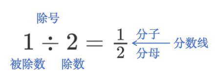
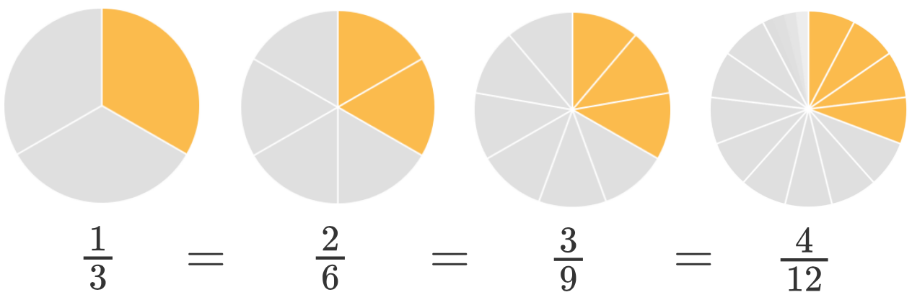
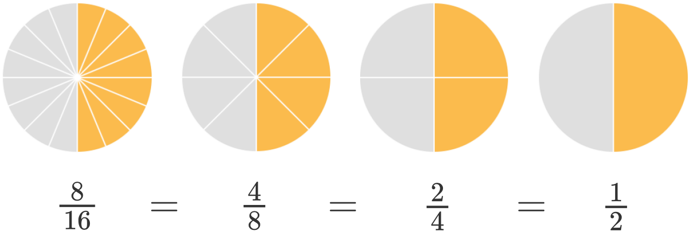
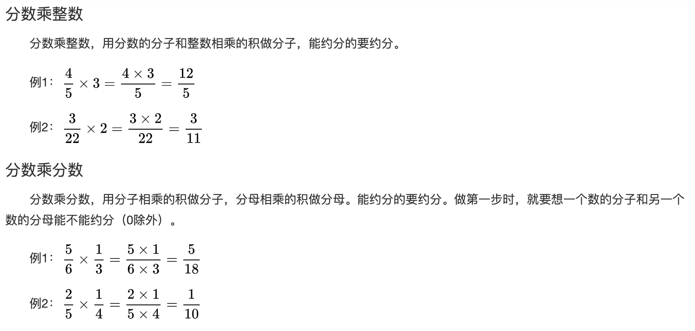
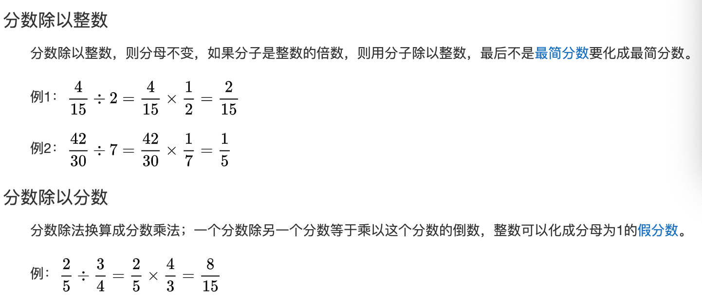

## 分数

### 定义

分数是指整体的一部分，表现形式为一个整数与另一个非0整数的比。

### 分数的组成

分子、分母、分数线

### 分数和除法的关系

把一个圆平均分成两份，每份占多少：

用除法表示为$1÷2$，用分数表示为$\frac12$，即：

所以这里我们能够看出被除数、除数、分子、分母、除号、分数线之间的关系：

被除数等价于分子

除数等价于分母

除号等价于分数线

商等价于分数值

### 真分数和假分数

真分数：分子小于分母，如$\frac34$

假分数：分子大于或等于分母，如$\frac43$

整数也可以看成假分数，如$1=\frac{2}{2}、2=\frac{4}{2}$

### 带分数 

带分数由整数和真分数组成

如：$3\frac{3}{4}$，读作“3又4分之3”

$3\frac{3}{4}=3+\frac{3}{4}=\frac{12}{4}+\frac34=\frac{15}{4}$

### 带分数与假分数的互换

1. $\frac87=$
2. $\frac{25}{7}=$
3. $\frac{75}{16}=$
4. $3\frac15=$

5. $6\frac37=$
6. $2\frac{1}{21}$

### 扩分 

分子和分母同时乘以一个非0的数，值不变

如$\frac13=\frac{1\times 2}{3\times2}=\frac{1\times 3}{3\times3}=\frac{1\times 4}{3\times4}$

### 约分

分子和分母同时除以一个非0的数，值不变

如$\frac{1}{2}=\frac{2÷2}{4÷2}=\frac{4÷4}{8÷4}=\frac{8÷8}{16÷8}$​

#### 最简分数

分子和分母的公因数只有1

分数的书写一定要写成最简形式

#### 小练习

1. $\frac{6}{18}=\frac{6÷6}{()÷6}=\frac{1}{()}$

2. $\frac{12}{20}=\frac{3}{()}$
3. $\frac{36}{54}=\frac{4}{()}$

4. $\frac{14}{35}=\frac{2}{()}$

5. $\frac{18}{24}=\frac{()}{4}$
6. $\frac{8}{6}=\frac{()}{3}$

### 比较大小 

1. 分母相同，分子越大值越大 

   如: $\frac{3}{5}>\frac{2}{5}$

2. 分子相同，分母越大值越小 

   如$\frac{3}{5}<\frac{3}{4}$

3. 分母、分子都不同，一般先化为同分母再比较大小 

   如$\frac{3}{4}、\frac{4}{5}$

   $\frac{3}{4}=\frac{3\times 5}{4\times 5}=\frac{15}{20}$​

   $\frac{4}{5}=\frac{4\times 4}{5\times 4}=\frac{16}{20}$​

   因为$\frac{15}{20}<\frac{16}{20}$，所以$\frac{3}{4}<\frac{4}{5}$

### 分数的加减法 

1. 同分母：分母不变，分子相加减

   如：$\frac35+\frac15=\frac{3+1}5=\frac45$

   $\frac35-\frac15=\frac{3-1}5=\frac25$

2. 异分母：先化为同分母，然后再按同分母方法计算 

   $\frac45+\frac34=\frac{16}{20}+\frac{15}{20}=\frac{16+15}{20}=\frac{31}{20}$

   $\frac45-\frac34=\frac{16}{20}-\frac{15}{20}=\frac{16-15}{20}=\frac{1}{20}$

#### 小练习

1. $\frac29+\frac29=$

2. $4+\frac14=$
3. $\frac{7}{15}+\frac{4}{21}=$

4. $\frac{12}{35}-\frac{7}{28}=$
5. $1\frac{2}{5}-\frac38=$

### 分数乘法

#### 小练习

1. $\frac{3}{11}\times\frac{1}{2}=$
2. $\frac{8}{9}\times\frac{3}{10}=$
3. $\frac{2}{15}\times4=$
4. $\frac{5}{12}\times8=$

5. $1.2\times\frac{3}{5}=$
6. $2\frac{3}{4}\times3\frac{2}{3}=$

### 分数除法

#### 倒数

数学上设一个数x与其相乘的积为1的数，记为1/x，过程为“乘法逆元”，除了0以外的数都存在倒数，分子和分母相倒并且两个乘积是1的数互为倒数，0没有倒数。

简单理解为把一个数的分子、分母颠倒位置

如：$\frac34的倒数是\frac43、2=\frac21的倒数是\frac12$

一个数与其倒数的乘积是1，如：

$\frac34 \times \frac43=1、2 \times \frac12=1$

 

#### 小练习

1. $\frac{3}{7}÷\frac{15}{11}=$
2. $1\frac{1}{6}÷\frac{7}{5}=$

3. $2\frac{1}{7}÷25=$

4. $\frac{8}{9}÷4=$
5. $15÷\frac{10}{13}=$

6. $2\frac{1}{6}÷3\frac{6}{11}=$

