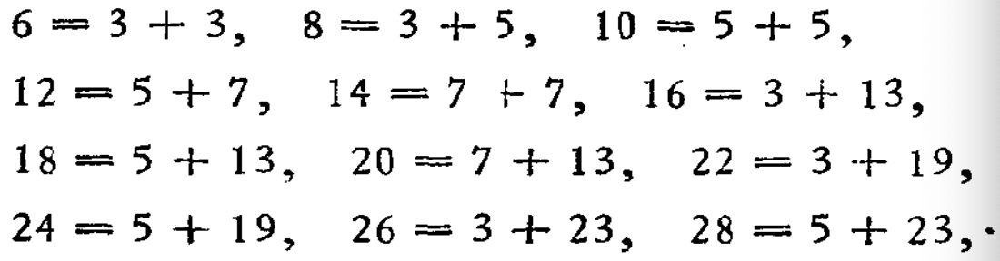

## 素（质）数与合数

### 定义

一个大于1的正整数，只能被1和它本身整除，不能被其他正整数整除，这样的正整数叫做素数或者质数

一个正整数除了能被1和本身整除以外，还能被另外的正整数整除，这样的正整数叫做合数

**由素数与合数的定义，全体正整数可分为三类：**

<ul style="color: #FDBC40;">
  <li>1</li>
</ul>

<ul style="color: #FDBC40;">
  <li>全体素数</li>
</ul>

<ul style="color: #FDBC40;">
  <li>全体合数</li>
</ul>

### 素因数

如果一个正整数a有一个因数b，而b又是素数，则b叫做a的素因数

如$12 = 3 \times 4$，所以3和4都是12的因数，由于3是素数而4不是，所以3是12的素因数

#### 小练习

4的素因数有哪些？

6的素因数有哪些？

8的素因数有哪些？

9的素因数有哪些？

#### 引理

以下引理需要记忆，不要求证明

1. 如果a是一个大于1的整数，则a的大于1的最小因数一定是素数
2. 如果a是一个大于1的整数，而所有$\leq \sqrt a$​的素数都除不尽a，则a是素数
3. 有无限多个素数

#### 目前已知的最大素数

$2^{82589933} - 1$

#### 孪生素数

相邻两个素数的差是2，则称这两个素数为孪生素数

#### 哥德巴赫猜想

**凡是大于4的偶数都可以表示为两个素数之和？**

