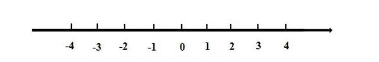

## 负数

### 为什么要引入负数

**我们来思考以下几个问题：**

<ul style="color: #FDBC40;">
  <li>温度</li>
</ul>

​	武汉市的气温是30℃，记气温30℃

​	哈尔滨的气温是零下30℃，**怎么记录气温？**

<ul style="color: #FDBC40;">
  <li>海拔</li>
</ul>

​	珠穆朗玛峰高于海平面8848.86米，记海拔8848.86米

​	吐鲁番盆地低于海平面154.31米，**怎么记录海拔？**

<ul style="color: #FDBC40;">
  <li>收入</li>
</ul>

​	A公司今年赚了100万元，即收入100万	

​	B公司今年亏了100万元，**怎么记录收入？**	

以上三个问题，我们都可以用负数来记录，**负数的引入可以帮助我们表示相反意义的量**

### 怎样表示负数

两个符号：

<ul style="color: #FDBC40;">
  <li>+</li>
</ul>

​	在描述数字时读作“正”，如：

​	   +1、+2、+3；对于正数，一般情况下会省略'+'号，直接书写1、2、3

<ul style="color: #FDBC40;">
  <li>-</li>
</ul>

​	在描述数字时读作“负”，如：

​	   -1、-2、-3，书写时不能省略符号	

写法是在正数前加上"-"，读作负

注意：0既不是正数也不是负数，即没有+0，-0的写法

### 相反数

<ul style="color: #FDBC40;">
  <li>认识数轴</li>
</ul>

1. 数轴上的数是从左到右递增排列的
2. 0的左边全是负数，0的右边全是正数
3. 数轴上每一个正数都有唯一一个负数与之对应

<ul style="color: #FDBC40;">
  <li>定义</li>
</ul>

​	当两个数符号相反且数字相同时，称这两个数互为相反数。如1和-1、2和-2、	3和-3

<ul style="color: #FDBC40;">
  <li>神奇的-1</li>
</ul>

 1. 除0以外，任何一个数乘以-1，相当于给这个数加上了一个负号，如：

    $1 \times (-1) = -1$

    $2 \times (-1) = -2$

 2. 任何一个数与-1的乘积，都等于这个数的相反数，如：

    1的相反数等于 $1 \times (-1) = -1$

    2的相反数等于 $2 \times (-1) = -2$

    -3的相反数等于$-3 \times (-1) = 3$​​

    注：

    1：任何数前面添加‘-’后，都等于这个数的相反数，如

    ​	$-2$  =  $-2$

    ​	$-(-3)$  =  3

    2：任何数前面添加‘+’后，都等于这个数本身，如

    ​	$+1 = 1$

    ​	$+2 = 2$

    ​	$+(-3) = -3$

 3. 互为相反数的两个数，它们的和等于0，如：

    $1 + (-1) = 0$

    $2 + (-2) = 0$

    $3 + (-3) = 0$​ 

### 负数的加法

加上一个负数就相当于在数轴上向左移动了多少个单位

* 正数加负数

  

  解释：加上一个负数就相当于减去这个负数的相反数。

  

* 负数加负数

  

  解释：两个负数相加，结果是一个更小的负数。

### 负数的减法

减去一个负数就相当于在数轴上向右移动了多少个单位

* 正数减负数

  

  解释：减去一个负数就相当于加上这个负数的相反数。

  

* 负数减负数

  

  解释：减去一个负数就像加上一个正数。

#### 练习

$(-16)+(-8)=$

$78+(-85)=$

$(-14)-(+15)=$

$(-15)+(+9)=$

$4-(-16)=$

### 负数的乘法和除法运算

记住两个规则：

<ul style="color: #FDBC40;">
  <li>一个正数与一个负数的积或商是负数</li>
</ul>

​	$3 \times (-2)$，这里的$-2 = -1 \times 2$，所以$3 \times (-2)$相当于$3 \times 2 \times (-1)$，也相当于$6 \times (-1) = -6$

<ul style="color: #FDBC40;">
  <li>两个负数的积或商是正数</li>
</ul>

​	$(-3) \times (-2)$，这里的$-3 = -1 \times 3，-2 = -1 \times 2$，所以$(-3) \times (-2)$相当于$(-1) \times 3 \times (-1) \times 2$，也相当于$(-1)\times(-1)\times6 = 6$

计算过程分为3步：

1. 确定计算结果是正数还是负数
2. 将有负号的数字去掉负号后再相乘或相除
3. 给第二步的结果添加相应的符号

例如：$(-5)\times6$

1. 确定计算结果是正数还是负数

   $(-5)\times6$是一个负数与一个正数相乘，所以结果是负数

2. 将有负号的数字去掉负号后再相乘或相除

   $5\times6=30$

3. 给第二步的结果添加相应的符号

   由第一步确定的结果是负数，所以要给第二步的计算结果添加负号，结果就是-30

#### 练习

$(-48)÷3=$

$(-4)\times (-6)=$

