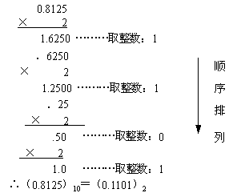

---
逐字稿
---

---

#### 开场白

---

同学们好，我是肖老师，欢迎大家来到CSP-J数学基础部分的学习。

上节课，我们学了十进制整数转非十进制整数的方法；这节课，我们来学习十进制小数转非十进制小数。

---

#### 十进制小数转非十进制小数

---

我们以十进制小数转换成二进制小数为例，介绍乘2取整，顺序排列法；它的具体做法是用2乘十进制小数，可以得到积，将积的整数部分取出，再用2乘余下的小数 部分，又得到一个积，再将积的整数部分取出，如此进行，直到积中的小数部分为零，或者达到所要求的精度为止，然后把取出的整数部分按顺序排列起来，先取的整数作为二进制小数的高位有效位，后取的整数作为低位有效位。

我们来看下这个例子，将$0.8125$转换为二进制小数

因为是换成二进制小数，所以我们采用乘2取整，顺序排列法

重复让小数部分乘2，取出整数部分，直到小数部分为0；

不过要注意的是，并不是所有十进制小数转二进制小数时，按这个方法，最后都能使小数部分为0，因为有可能十进制小数转二进制小数时出现小数部分无限循环的情况，在这种情况下，我们只需要根据要求，保留小数部分的精度就可以了。

我们来做个练习

我们知道了十进制小数转换成二进制小数的方法，那十进制小数转八进制或十六进制数，怎么转换呢？

通常我们会先将十进制小数转换成二进制小数，然后再将二进制小数转换为八进制或十六进制数；

下节课，老师会介绍二进制数、八进制数、十六进制数之间的转换

---

#### 总结

---

本次课，我们学习了十进制小数转换成二进制小数的方法，使用的是乘2取整，顺序排列法；而对于十进制小数转换成八进制或十六进制数，通常我们会先将十进制小数转换成二进制小数，然后再将二进制小数转换为八进制或十六进制数，这部分内容，老师会在之后的课程中介绍。