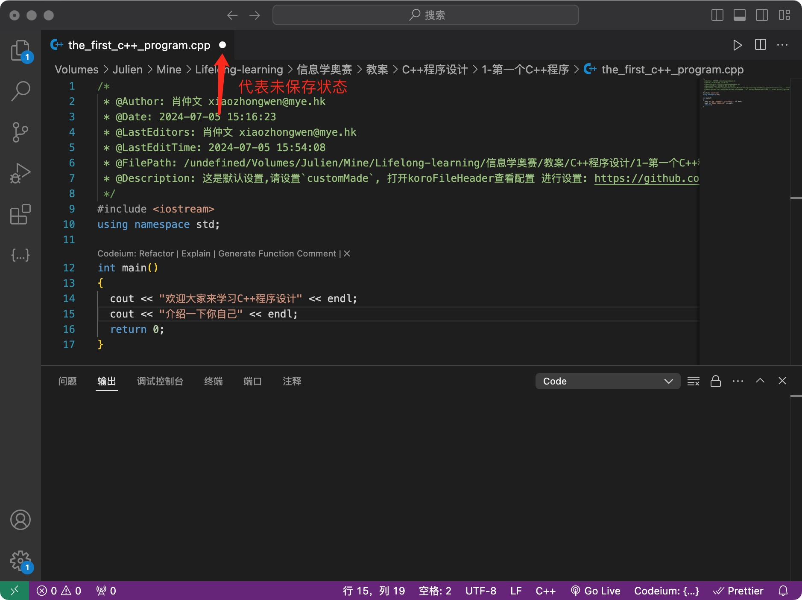
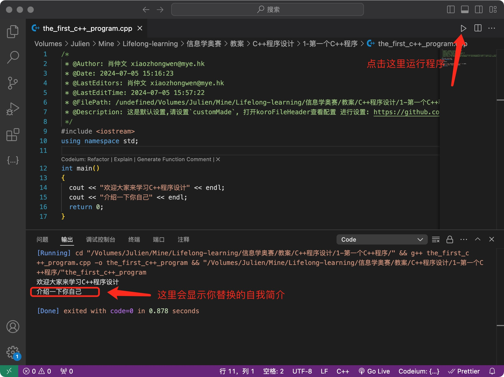

## 介绍C++

### C++的作者


<center><b>Bjarne Stroustrup</b></center>

贝雅尼·斯特劳斯特鲁普（Bjarne Stroustrup），生于1950年12月30日。1979年，在美国贝尔实验室，他开始设计C++编程语言，他以创造C++编程语言而闻名，被称为“C++之父”。

### 为什么要发明C++

C++ 是对 C 语言的扩展，由于C 语言缺乏对大型软件开发中非常重要的面向对象编程支持，Bjarne Stroustrup 希望将面向对象的概念引入 C 语言，使得开发人员可以更好地组织和管理复杂的软件系统。

### C++的发展

#### 早期阶段 1979-1985

Bjarne Stroustrup 在贝尔实验室开始开发 "C with Classes"，这是 C++ 的前身；1985 年，Bjarne Stroustrup 出版了《The C++ Programming Language》一书，标志着 C++ 的正式发布。

#### 标准化阶段 1989-1998

1998 年，ISO/IEC 发布了第一个 C++ 国际标准，称为 C++98 (ISO/IEC 14882:1998)，标准化了语言特性和标准库。

#### 现代化阶段

* 2003 年，发布了 C++03，主要是对 C++98 进行小幅修订和错误修正
* 2011 年，发布了 C++11，标志着现代 C++ 的诞生。C++11 引入了大量新特性
* 2014 年，**发布了 C++14**，进一步改进和完善了 C++11，引入了一些小的语法和库改进
* 2017 年，发布了 C++17，增加了文件系统库 (`<filesystem>`)、if constexpr 和嵌套命名空间等新特性
* 2020 年，发布了 C++20，这是一次重大更新，引入了模块、协程、概念、范围库 (`<ranges>`) 和日历库 (`<chrono>`) 等重要特性

### C++开发的产品

* 操作系统

  

* 浏览器

  

* 游戏引擎

  

* 图形和多媒体

  

### C++代码

```c++
#include <iostream>
using namespace std;

int main() {
    cout << "Hello, World!" << endl; // 输出 Hello, World!
    
    int age;
    cout << "请输入你的年龄: ";
    cin >> age; // 输入年龄
    cout << "你已经 " << age << " 岁了!" << endl; // 输出年龄
    
    return 0;
}
```


## 其他编程语言

2024年排名前50的编程语言--主要基于全球开发者的使用量


1. Python
   - **数据科学和机器学习**：使用库如 NumPy、Pandas、TensorFlow 和 scikit-learn。
   - **Web 开发**：使用框架如 Django 和 Flask。
   - **自动化和脚本编写**：适用于各种自动化任务和系统脚本。
   - **科学计算**：使用 SciPy 和 Matplotlib 进行科学和工程计算。
   - **人工智能和深度学习**：使用 PyTorch 和 Keras 等库。

2. C
   - **系统编程**：开发操作系统、嵌入式系统和硬件驱动程序。
   - **嵌入式系统**：适用于微控制器和实时系统开发。
   - **高性能计算**：用于性能要求高的应用程序，如游戏引擎和数据库引擎。
   - **编译器开发**：编写和优化编译器和解释器。

3. C++
   - **游戏开发**：使用 Unreal Engine 和其他高性能游戏引擎。
   - **系统软件**：操作系统、数据库管理系统和嵌入式系统。
   - **实时系统**：航空航天、汽车和机器人控制系统。
   - **图形应用**：计算机图形和图像处理，如 OpenGL 和 DirectX 应用程序。

4. Java
   - **企业级应用**：大型企业系统、银行系统和电子商务平台。
   - **Android 应用开发**：使用 Android SDK 开发移动应用。
   - **Web 应用**：使用 Spring 和 JavaServer Faces 等框架。
   - **大数据处理**：使用 Hadoop 和 Apache Spark。

5. C#
   - **Windows 应用开发**：使用 .NET 框架开发桌面应用和服务。
   - **Web 应用**：使用 ASP.NET 开发动态网站和 Web 服务。
   - **游戏开发**：使用 Unity 引擎开发 2D 和 3D 游戏。
   - **企业软件**：ERP 和 CRM 系统开发。

6. JavaScript
   - **前端开发**：使用 React、Angular 和 Vue.js 构建交互式用户界面。
   - **后端开发**：使用 Node.js 构建服务器端应用和 API。
   - **全栈开发**：结合前端和后端技术进行全栈开发。
   - **移动应用开发**：使用 React Native 和 Ionic 开发跨平台移动应用。

7. Visual Basic
   - **Windows 应用开发**：使用 VB.NET 开发 Windows 窗体应用和 Office 插件。
   - **自动化**：编写 Office 宏和自动化任务。
   - **数据库访问**：快速开发数据库驱动的应用程序。

8. Go (Golang)
   - **云计算和微服务**：开发高并发、高性能的微服务和云原生应用。
   - **网络编程**：构建网络服务器和分布式系统。
   - **系统工具**：开发命令行工具和系统工具。
   - **容器化应用**：与 Docker 和 Kubernetes 紧密结合。

9. SQL
   - **数据库管理**：创建、查询、更新和管理关系数据库。
   - **数据分析**：执行复杂的数据查询和分析操作。
   - **商业智能**：构建数据仓库和商业智能解决方案。
   - **ETL 过程**：数据提取、转换和加载任务。

10. Fortran
   - **科学计算和数值分析**：高效处理大规模数值计算，如气象模拟和天体物理模拟。

   - **工程计算**：结构分析、流体动力学和热力学等工程领域。

   - **高性能计算**：超级计算机上的计算密集型任务。

   - **遗留系统维护**：维护和更新使用 Fortran 编写的旧系统。

     

## 为什么要选择学习C++

* 推荐语

​	**Bjarne Stroustrup**（C++ 的创造者）：

​	`C++ 是一种通用编程语言，偏向于系统编程，它是更好的 C，支持数据抽象、面向对象编程和泛型编程。`

​	**Linus Torvalds**（Linux 内核的创始人）：

​	`C++ 是一种可怕的语言。很多低水平的程序员使用它，这让它变得更糟，以至于很容易用它生成完全垃圾的代码。`

​	`但是，尽管如此，C++ 对于性能关键的应用来说非常强大和有用。`

​	**Herb Sutter**（C++ 标准委员会主席）：

​	`C++ 不仅仅是一种编程语言，它还是一种教你以更高效的方式思考和解决问题的语言。`

​	**James Gosling**（Java 的创造者）：

​	`C++ 是一种为了操控 C 的强大和复杂性而设计的语言，提供了一个更安全的高级环境用于系统编程。`

* 应用领域

  C++ 被广泛应用于各个行业，包括金融、游戏、汽车、航空航天和科学计算等。

* 一直是全球排名前三的编程语言

* NOI指定语言

  

## 怎么学好C++

* 熟悉C++关键字

  基本类型关键字：**bool**、**char**、char16_t、char32_t、**double**、**float**、**int**、**long**、**short**、**signed**、**unsigned**、**void**、wchar_t

  存储类型关键字: auto、extern、register、**static**、thread_local

  类和结构关键字: **class、struct、union**

  控制语句关键字：**break、case、continue、default、do、else、for**、goto、**if、return、switch、while**

  操作符关键字：alignas、alignof、**and**、and_eq、asm、bitand、bitor、compl、**not**、not_eq、**or**、or_eq、**xor**、xor_eq、**sizeof**、typeid、decltype、const_cast、dynamic_cast、reinterpret_cast、static_cast

  异常处理关键字：catch、try、throw

  修饰符关键字：**const**、constexpr、explicit、export、friend、mutable、**namespace**、noexcept、operator、private、protected、public、**this**、**using**、virtual

  模板关键字：template、typename

  内存管理关键字：**new、delete**

  其他关键字：**false、true、nullptr**、static_assert、decltype、**enum**、inline、**typedef**

* 掌握C++语法知识

  * 基本语法

    **基本数据类型**：`int`, `char`, `float`, `double`, `bool`, `void`

    **变量声明**：变量类型和变量名

    **常量**：使用 `const` 

    **基本操作符**：算术操作符（`+`, `-`, `*`, `/`, `%`），关系操作符（`==`, `!=`, `<`, `>`, `<=`, `>=`），逻辑操作符（`&&`, `||`, `!`）

  * 控制语句

    **条件语句**：`if`, `else if`, `else`, `switch`, `case`, `default`

    **循环语句**：`for`, `while`, `do while`

    **跳转语句**：`break`, `continue`, `return`

  * 函数

    **函数声明与定义**：`返回类型 函数名(参数列表) { 函数体 }`

  * 字符串

  * 数组

  * 结构体

  * 指针

  * STL模板

* 不要看、要练


## 用什么工具编写C++程序

VSCode：由微软开发的，一款轻量级、速度快、跨平台并支持多种编程语言的代码编辑器。

* [下载与安装](https://code.visualstudio.com/)

  

* 安装VSCode扩展

  

  

  搜索框中输入：c/c++

  

  

  搜索框中输入：code runner

  

  

## 第一个C++程序 

* 打开或创建`the_first_c++_program.cpp`文件

  

  

* 保存程序

  

  

* 运行程序

  
