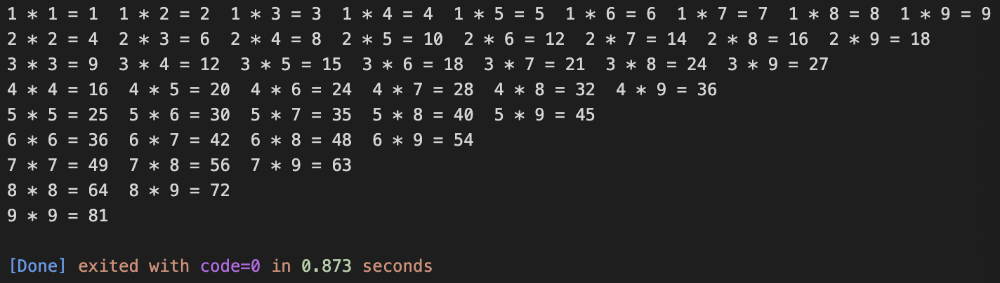

## 循环结构

### while语句


**每次循环都需要先判断真值，如果条件真值为true，就进入循环，否则就跳出循环**


```c++
// 循环输出0到100间的偶数
#include <iostream>
using namespace std;

int main() {
  int i = 0;
  // 先判断i的值是否小于等于100, 如果关系表达式的真值为true, 则进入循环
  while (i <= 100) {
    // 判断i是否是偶数
    if (i % 2 == 0) {
      // 输出到控制台
      cout << i << endl;
    }
    // 变量i自增
    i++;
  }

  return 0;
}
```


### do-while循环


**先执行循环体，再判断真值，如果条件真值为true，就再进入循环，否则就跳出循环**

```c++
// 循环输出0到100间的偶数
#include <iostream>
using namespace std;

int main() {
  int i = 0;
  // 先执行循环体
  do {
    // 判断i是否是偶数
    if (i % 2 == 0) {
      // 输出到控制台
      cout << i << endl;
    }
    // 变量i自增
    i++;
  } while (i <= 100) 
  // 最后判断真值，如果条件真值为true，就再进入循环，否则就跳出循环

  return 0;
}
```


### for循环


**常用于固定次数的循环**

```c++
// 循环输出0到100间的偶数
#include <iostream>
using namespace std;

int main() {
  // 1. 定义整型变量i记录循环次数, 初始值为0
  // 2. 每次执行循环体前, 判断i是否小于等于100, 如果是, 就进入循环, 否则退出循环
  // 3. 每次循环体执行结束后, 通过i++, 完成变量i的自增
  for (int i = 0; i <= 100; i++) {
    // 判断i是否是偶数
    if (i % 2 == 0) {
      // 输出到控制台
      cout << i << endl;
    }
  }
  return 0;
}
```


### 循环嵌套

`for循环`、`while循环`、`do-while循环`分别都可以嵌套使用，我们已经输出九九乘法表为例演示`for循环`的嵌套。



```c++
#include <iostream>
using namespace std;

int main() {
  // 外层循环, 变量i由1~9, 循环9次
  for (int i = 1; i < 10; i++) {
    // 内层循环, 变量j有i~9, 循环10-i次
    for (int j = i; j < 10; j++) {
      // 输出i与j的乘积等式并空格
      cout << i << " * " << j << " = " << i * j << "  ";
    }
    // 每完成1行的输出, 就换一行
    cout << endl;
  }

  return 0;
}
```

同样可以使用`while循环`嵌套、`do-while循环`嵌套以及它们三个的混合嵌套来编写九九乘法表代码。


### 循环退出

* break

  结束当前循环

  ```c++
  #include <iostream>
  using namespace std;
  
  int main() {
      // 定义整型变量i, 初始值为0
      int i = 0;
      // 定义整型变量target, 初始值为50
      int target = 50;
      // 判断i是否小于100
      while (i < 100) {
          // 变量i自增
          i++;
          // 判断i是否等于target
          if (i == target) {
              // 当i的值等于50的时候, 就会跳出while循环
              break;
          }
          // 输出i的值
          cout << i << endl;
      }
      return 0;
  }
  ```

* continue

  结束当次循环

  ```c++
  #include <iostream>
  using namespace std;
  
  int main() {
      // 定义整型变量i, 初始值为0
      int i = 0;
      // 判断i是否小于100
      while (i < 100) {
          // 变量i自增
          i++;
          // 判断i是否是偶数
          if (i % 2 == 0) {
              // 当i是偶数时, 结束当次循环; 继续下一次循环
              continue;
          }
          // 输出i的值
          cout << i << endl;
      }
      return 0;
  }
  ```


#### 下面程序会输出什么？

```c++
#include <iostream>
using namespace std;

int main() {
    // 定义整型变量i, 初始值为0, i的值有0~10, 循环11次
    for (int i = 0; i <= 10; i++) {
        // 判断i是否是偶数
        if (i % 2 == 0) {
            // 当i是偶数时, 结束当次循环; 继续下一次循环
            continue;
        }
        // 输出i的值
        cout << i << endl;
        // 判断i是否大于5
        if (i > 5) {
            // i大于5就结束循环
            break;
        }
    }
    
    return 0;
}
```

