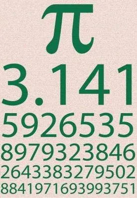
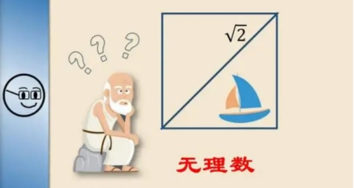
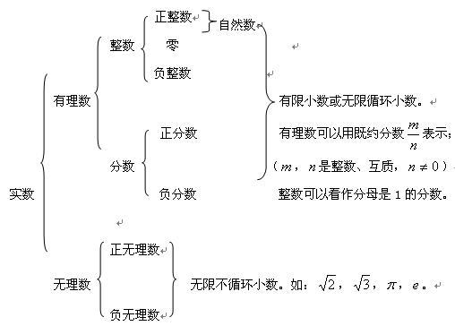

## 自然数、整数、有理数、无理数、实数

### 自然数

指大于或等于0的整数，用数码0、1、2、3、4....表示；它是由0开始，一个接着一个组成的一个无穷集合

最小的自然数是0

不存在最大的自然数

### 整数

由自然数以及负整数（-1、-2、-3...）组成的集合

整数不存在最大值和最小值

### 有理数

#### 名字的由来

有理数一词是从西方传来，在英语中是rational number，而rational通常的意义是“理性的”；而这个词的词源来自于古希腊，它的英文词根为ratio，就是比率的意思；描述的就是整数的“比”；所以有理数并不表示比别的数更“有道理”，这是一个翻译上的失误；与之相对，“无理数”就是不能精确表示为两个整数之比的数。

#### 定义

指可以表示为两个整数比（即分数形式）的数；包括整数、分数（整数也可看作是分母是1的分数）以及0；有理数也可以表示为有限小数和无限循环小数

### 无理数

无理数也称为无限不循环小数，不能表示为两个整数之比的形式。

#### 常见的无理数

### 实数

实数，是有理数和无理数的总称

### 小练习

$\frac{3}{7}÷(-2\frac{1}{7})\times(-64)÷3\frac{1}{5}\times \frac58=$

$-2^2\times (-\frac{1}{2})+8÷(-2)^2=$

$-4^2÷(-1\frac35)-\frac56\times(-\frac34)=$

$(-\frac58)\times(-4)^2-0.25\times(-5)\times(-4)^3=$

$(-5)^3\times(-\frac35)+32÷(-2^2)\times(-1\frac14)=$