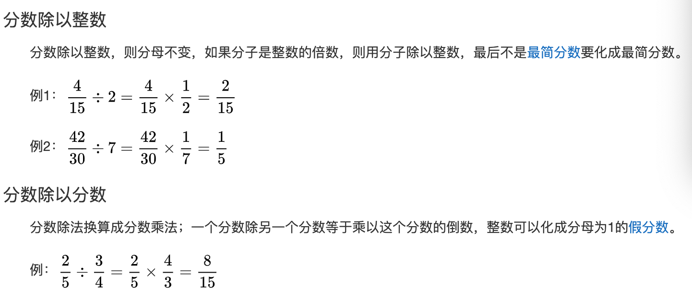

## 分数

### 扩分 `NO.NM110`

分子和分母同时乘以一个非0的数，值不变

如$\frac13=\frac{1\times 2}{3\times2}=\frac{1\times 3}{3\times3}=\frac{1\times 4}{3\times4}$

### 约分 `NO.NM120`

分子和分母同时除以一个非0的数，值不变

如$\frac{1}{2}=\frac{2÷2}{4÷2}=\frac{4÷4}{8÷4}=\frac{8÷8}{16÷8}$​

### 比较大小 `NO.NM130`

1. 分母相同，分子约大值越大 `NO.NM131`

   如: $\frac{3}{5}>\frac{2}{5}$

2. 分子相同，分母越大值越小 `NO.NM132`

   如$\frac{3}{5}<\frac{3}{4}$

3. 分母、分子都不同，一般先化为同分母再比较大小 `NO.NM133`

   如$\frac{3}{4}、\frac{4}{5}$

   $\frac{3}{4}=\frac{3\times 5}{4\times 5}=\frac{15}{20}$​

   $\frac{4}{5}=\frac{4\times 4}{5\times 4}=\frac{16}{20}$​

   因为$\frac{15}{20}<\frac{16}{20}$，所以$\frac{3}{4}<\frac{5}{4}$

   

### 真分数、假分数 `NO.NM140`

真分数：分子小于分母，如$\frac34$

假分数：分子大于或等于分母，如$\frac43$

整数也可以看成假分数，如$1=\frac{2}{2}、2=\frac{4}{2}$

### 带分数 `NO.NM150`

带分数由整数和真分数组成

如：$3\frac{3}{4}$，读作“3又4分之3”

$3\frac{3}{4}=3+\frac{3}{4}=\frac{12}{4}+\frac34=\frac{15}{4}$

### 倒数 `NO.NM160`

数学上设一个数x与其相乘的积为1的数，记为1/x，过程为“乘法逆元”，除了0以外的数都存在倒数，分子和分母相倒并且两个乘积是1的数互为倒数，0没有倒数。

简单理解为把一个数的分子、分母颠倒位置

如：$\frac34的倒数是\frac43、2=\frac21的倒数是\frac12$

一个数与其倒数的乘积是1，如：

$\frac34 \times \frac43=1、2 \times \frac12=1$

### 分数的加减法 `NO.NM170`

1. 同分母：分母不变，分子相加减 `NO.NM171`

   如：$\frac35+\frac15=\frac{3+1}5=\frac45$

   $\frac35-\frac15=\frac{3-1}5=\frac25$

2. 异分母：先化为同分母，然后再按同分母方法计算 `NO.NM172`

   $\frac45+\frac34=\frac{16}{20}+\frac{15}{20}=\frac{16+15}{20}=\frac{31}{20}$

   $\frac45-\frac34=\frac{16}{20}-\frac{15}{20}=\frac{16-15}{20}=\frac{1}{20}$

### 分数乘法 `NO.NM180`

### 分数除法 `NO.NM190`

