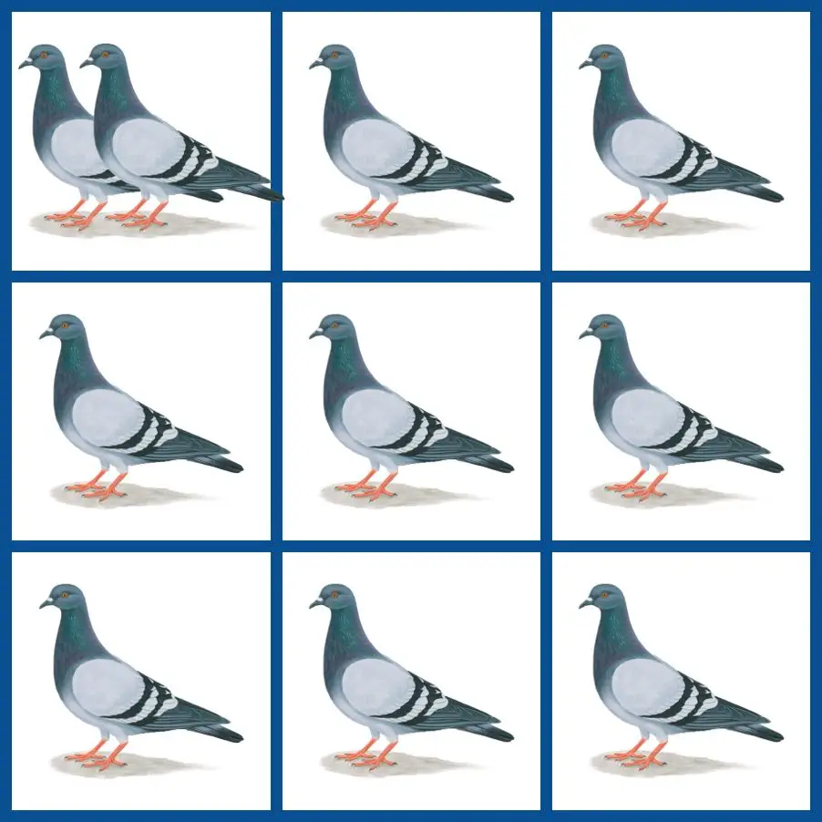

## 鸽巢原理

### 小思考

有3把椅子，请4个同学上来坐，要求每个同学都要坐在其中一把椅子上，是否一定有其中一把椅子上坐了2名同学？


### 定义



有10只鸽子，要放入9个笼子，那么无论如何，至少有一个笼子里要装进最少2只鸽子。这一现象就是<font color="#FDBC40">鸽巢原理</font>，也叫<font color="#FDBC40">抽屉原理</font>。

它的一般含义为，如果每个鸽巢代表1个集合，每只鸽子就可以代表1个元素，<font color="#FDBC40">假如将$n+1$个元素放到$n$个集合中，其中必定有1个集合里至少有2个元素</font>。


### 推论

1. $m$只鸽子，$n$个笼子，则至少有一个鸽笼里有不少于$\frac{m-1}{n}+1$只鸽子。
2. 若取$n \times (m-1)+1$个球放进$n$个盒子，则至少有一个盒子有$m$个球。
3. 若$m_1,m_2,...,m_n$是$n$个正整数，而且$\frac{m_1+m_2+...+m_n}{n}>r-1$，那么$m_1,m_2,...,m_n$中至少有一个数不小于$r$。


### 常见应用

1. 构造鸽巢的方法

   <font color="#FDBC40">运用鸽巢原理的核心是分析清楚问题中，哪个是鸽子，哪个是鸽巢。</font>例如，属相是有12个，那么任意37个人中，至少有一个属相是不少于4个人。<font color="#FDBC40">一般在问题中，较多的一方是鸽子，较少的一方就是鸽巢</font>，比如上述问题中的属相12个，就是对应鸽巢，37个人就是对应鸽子，因为37相对12多。

2. 最差原则

   <font color="#FDBC40">最差原则，即考虑所有可能情况中，最不利于某件事情发生的情况</font>，如：

   有红、黄、蓝三种颜色的袜子各10只，混放在一个暗箱中。请问：在看不见颜色的情况下，至少要取出多少只袜子才能保证取出两双颜色不同的袜子？

   从最差原则来看，我们先从暗箱中取出10只同色的袜子，比如10只红色袜子。然后，再取1只黄色袜子和1只蓝色袜子。到现在为止，还是没有满足“两双颜色不同的袜子”的要求。但是，只要我们再从剩下的黄色和蓝色两种颜色的袜子中多取一只，就又能凑齐第二双同色袜子了。于是，我们一共需要取10＋1＋1＋1＝13只袜子才能保证满足题目的要求。


### 小练习

```
1. 在13个人中存在2个人，他们的生日在同一个月份里？

```

```
2. 一个班级里有30个学生，至少有多少个学生的生日是在同一个月份？


```

```
3. 设有n对已婚夫妇，为保证能够有一对夫妇被选出，至少要从这些人中选出多少人？


```

```
4. 从一个装有5双黑袜子和5双白袜子的抽屉里，至少要拿出多少只袜子，才能保证至少有一双颜色相同的袜子？


```

```
5. 有20颗糖果分给5个孩子，证明至少有一个孩子得到至少4颗糖果。


```

```
6. 将一个标准的8x8国际象棋棋盘涂成红色和黑色相间的格子，证明任意放置33个棋子，其中至少有两个棋子放在同一颜色的格子上


```

```
7. 假如一门课的考试分数是从0~100的整数，那么在102位考生中至少有几位是分数相同的？


```

```
8. 从一副完整的54张扑克牌中，至少取出多少张，才能保证四种花色都出现？


```

```
9. 为了丰富同学们的课外知识，学校开设了天文、地理、演讲和航模四个兴趣小组，每位同学最多可以报两个兴趣小组，也可以不参加。请问：至少需要多少学生才能保证有7个人参加小组的情况完全相同？


```

```
10. 在一个边长为4的正方形上，任意放入9个点，则其中必有3个点，它们构成的三角形的面积不超过2


```

