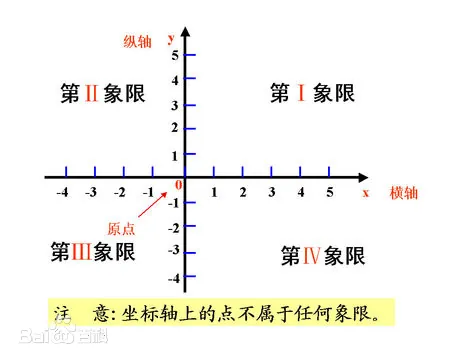

## 函数基础

### 数轴

如何在一维直线上描述一个点的位置？

#### 三要素

1. 原点

2. 正方向

3. 单位长度

#### 特点

1. 原点左边的数全都小于0，是负数
2. 原点右边的数全都大于0，是正数

3. 所有的数沿着正方形上增加
4. 数轴上的每一个点都与实数一一对应

**我们可以借助数轴这个数学工具来描述一维直线上点的位置，如：**

点A：在数轴正方向上，距离原点3个单位长度处

点B：在数轴负方向上，距离原点2个单位长度处

### 平面直角坐标系

如何在二维平面上描述一个点的位置？

#### 特点

1. 由两条相互垂直的数轴组成
2. 横轴称$x轴$，正方向由左向右
3. 纵轴称$y轴$，正方向由下向上
4. $x轴与y轴有公共的原点O$​​
5. $x轴与y轴$将平面分成了四个区域，沿逆时针方向分别为**第一象限**，**第二象限**，**第三象限**，**第四象限**

**我们可以借助平面直角坐标系这个数学工具来描述二维平面上点的位置**

在平面直角坐标系中，我们可以用**有序数对**来描述二维平面上点的位置，如：

**点A：**用**有序数对(10,15)**表示，其中10表示点A在$x轴$上的映射值、15表示点A在$y轴$上的映射值

### 函数

观察一下X与Y的映射关系?

* 映射关系1

* 映射关系2

  

  

#### 定义

在一个变化过程中，假设有两个变量x、y，如果对于任意一个x都有唯一确定的一个y和它对应，那么就称x是自变，y是x的函数。x的取值范围叫做这个函数的定义域，相应y的取值范围叫做函数的值域。

其中$x$称自变量（即变量$x$主动变化），$y$称因变量（即变量$y$因$x$的变化而变化）

#### 三要素

1. 定义域，即变量$x$能够取到的所有值所组成的集合
2. 值域，即变量$y$能够取到的所有值所组成的集合
3. 映射关系，即$x→y$的对应关系

### 一次函数

### 

