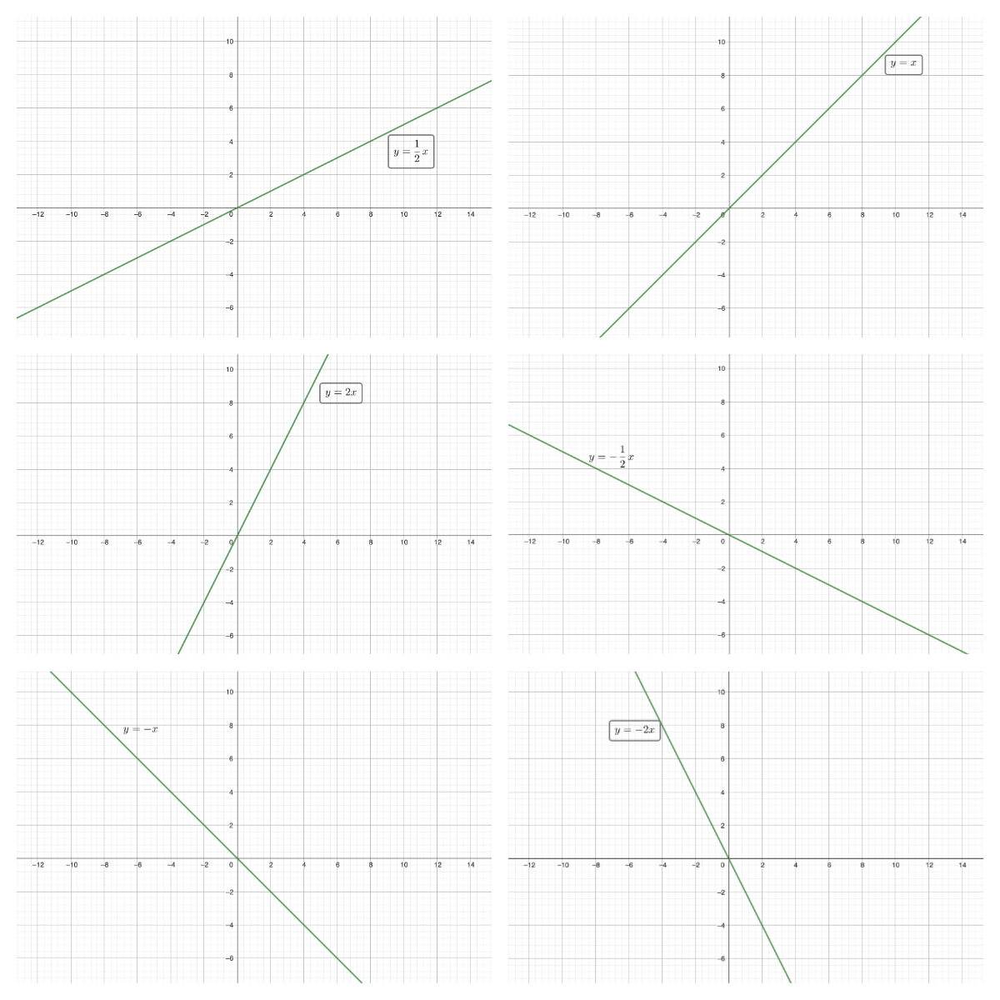
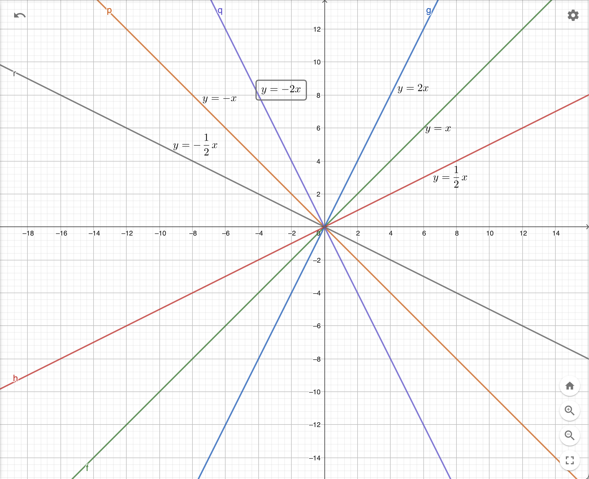
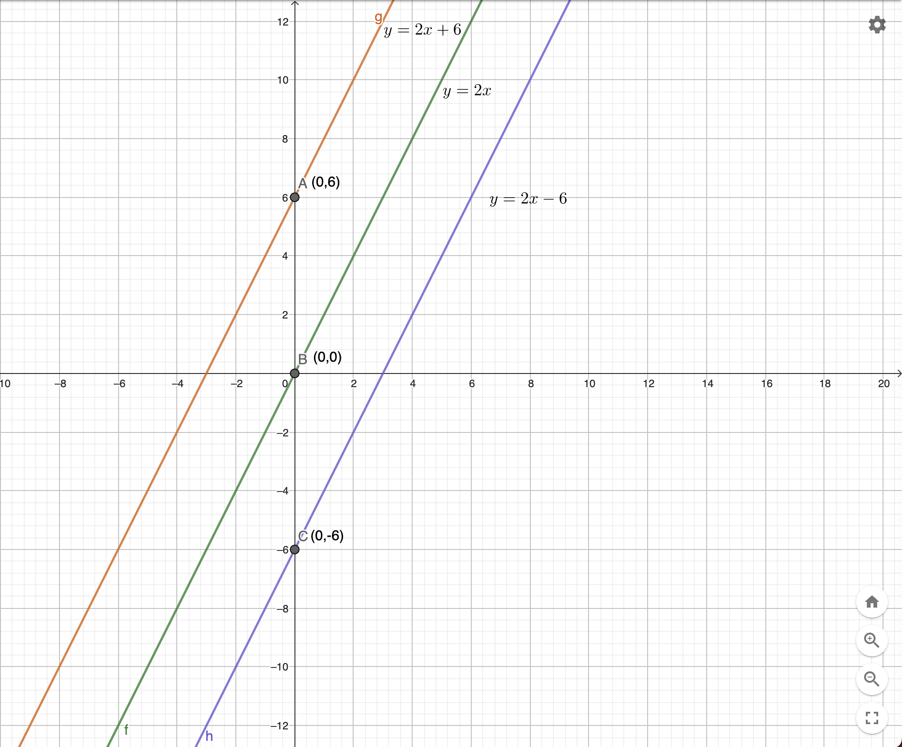
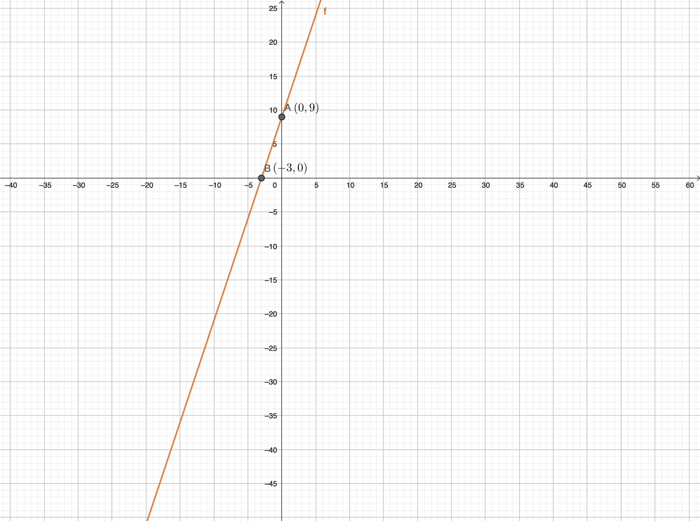

## 一次函数

一次函数的<font color="#FDBC40">函数表达式为$y=kx+b$，其中$k,b$是常数，并且$k \neq 0$</font>，$x$是自变量$(x \in R，R为全体实数)$，$y$是因变量。<font color="#FDBC40">当$b=0$时</font>，$y=kx$，此时<font color="#FDBC40">$y$是$x$的正比例函数</font>

$y=kx+b$是一次函数，是因为<font color="#FDBC40">自变量$x$的指数部分是1</font>

---

$下列函数中，y是x的一次函数的有()$

(1) $y = x + 1$			(2) $y=x^2+1$

(3) $y=\frac{1}{x}$			      (4) $y = \frac{x}{2}$

(5) $y = 0$				(6) $y = 2x$

---

#### 图像

一次函数$y=kx+b$<font color="#FDBC40">在平面直角坐标上的图像是一条直线</font>

#### 性质

* 斜率

  一次函数$y=kx+b$中，常数$k$表示的是<font color="#FDBC40">一次函数图像与x轴正方向的夹角的正切值</font>，反映的是<font color="#FDBC40">在平面直角坐标系中一条直线与x轴的倾斜程度的量</font>

  `在以下6个一次函数中，我们看k的值对函数图像的影响是什么？`

  

  

  **合并后的图**

  

  通过函数图像我们可以发现：

  1. <font color="#FDBC40">一次函数图像与x轴的夹角随着k的增大而增大</font>
  2. <font color="#FDBC40">当k>0时，一次函数图像一定穿过一、三象限，因变量$y$随着自变量$x$增大而增大</font>
  3. <font color="#FDBC40">当k<0时，一次函数图像一定穿过二、四象限，因变量$y$随着自变量$x$增大而减小</font>


* 截距

  $b$表示一次函数与$y$​轴的截距

  `在以下3个一次函数中，我们看b的值对函数图像的影响是什么？`

  

​	通过函数图像我们可以发现：

​	一次函数$y=kx+b$与$y$轴的交点即为$(0,b)$，如：

​	函数y=x+<font color="#FDBC40">6</font>与$y$轴的交点为(0,<font color="#FDBC40">6</font>)


* 平移

  函数图像在平面直角坐标上的移动称为函数<font color="#FDBC40">图像的平移</font>，平移分为<font color="#FDBC40">上下平移</font>和<font color="#FDBC40">左右平移</font>

  

  * 上下平移

    <font color="#FDBC40">口诀：上加下减</font>

    函数表达式中<font color="#FDBC40">对因变量$y$加上一个正整数$n$</font>，则函数图像就会<font color="#FDBC40">向上平移$n$个单位长度</font>

    函数表达式中<font color="#FDBC40">对因变量$y$减去一个正整数$n$</font>，则函数图像就会<font color="#FDBC40">向下平移$n$​个单位长度</font>

    ```
    如将函数y=2x向上平移6个单位长度后，则函数表达式变为y=2x+6
    如将函数y=2x向下平移6个单位长度后，则函数表达式变为y=2x-6
    ```

  * 左右平移

    <font color="#FDBC40">口诀：左加右减</font>

    函数表达式中<font color="#FDBC40">对自变量$x$加上一个正整数$n$</font>，则函数图像就会<font color="#FDBC40">向左平移$n$个单位长度</font>

    函数表达式中<font color="#FDBC40">对自变量$x$减去一个正整数$n$</font>，则函数图像就会<font color="#FDBC40">向右平移$n$​个单位长度</font>

    ```
    如将函数y=2x向左平移3个单位长度后，则函数表达式变为y=2(x+3)=2x+6
    如将函数y=2x向右平移3个单位长度后，则函数表达式变为y=2(x-3)=2x-6
    ```

---

下列函数经过怎样的变换可以得到右边的函数？

1. $y=x-4$          →	<font color="#FDBC40">$y=x+5$</font>
2. $y=2x-4$        →	<font color="#FDBC40">$y=2x+8$</font>
3. $y=2x-4$        →	<font color="#FDBC40">$y=2x$</font>

---


#### 求函数表达式

我们知道<font color="#FDBC40">在平面上任意两个点就能唯一确定一条直线</font>，那么如果在平面直角坐标系中<font color="#FDBC40">任意给定了两个点的坐标，那么就能唯一确定一条经过这两个点的直线，而这条直线的函数表达式也就能够确定下来</font>

如果一条直线经过$A(0,9)$和$B(-3,0)$两点，那么该一次函数的表达式是什么？



1. 写出一次函数的一般表达式

   $y=kx+b$

2. 将点A代入表达式

   <font color="#FDBC40">9</font> = k $\times$ <font color="#FDBC40">0</font> + b，得到b=9

3. 将点B代入表达式

   <font color="#FDBC40">0</font> = k $\times$ <font color="#FDBC40">-3</font> + b，得到k=3

4. 该函数表达式为

   $y=3x+9$

   
