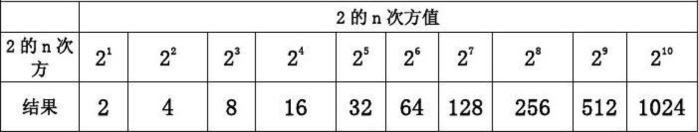

## 十进制整数转非十进制整数

#### 除基倒序取余法

1. 反复除以基数得到商和余数
2. 商继续除基数直到为0为止
3. 余数倒序即为结果

**十进制数转二进制数**

**$13=(1101)_2$​**

**十进制数转八进制数**

**$127=(177)_8$**

**十进制数转十六进制数**

**$127=(7F)_{16}$**

  

#### 按位权拆分法

相当于将十进制数用其它进制的位权组合表示，然后根据位权组合写出对应的数码组合

$13 = 8 + 4 + 1 = $1$\times 2^3 + $1$\times 2^2 + $0$ \times 2^1 + $1$\times 2^0 = ($1101$)_2$

$127 = $1$\times 8^2 + $7$\times 8^1 + $7$ \times 8^0 = ($177$)_8$

$127 = $7$\times 16^1 + $15$ \times 16^0 = ($7F$)_{16}$​

