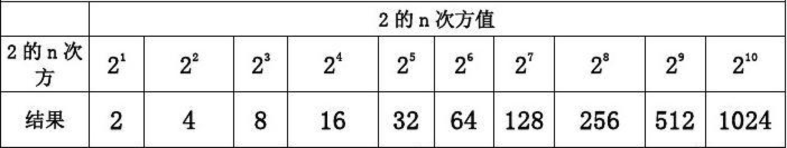
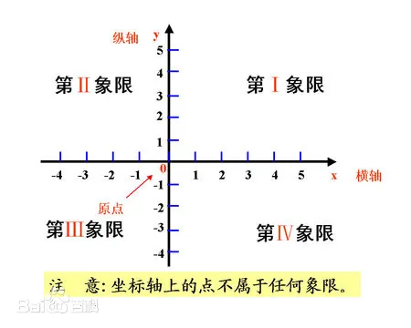
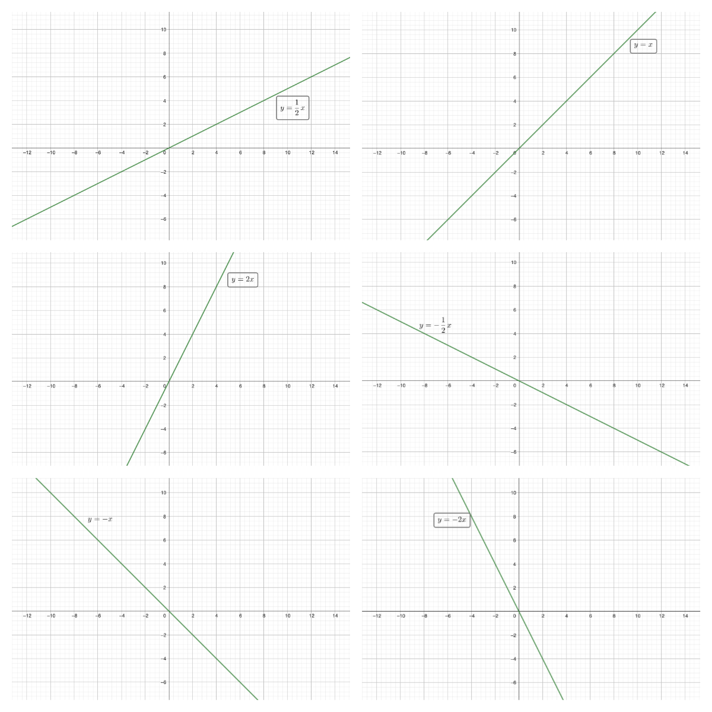
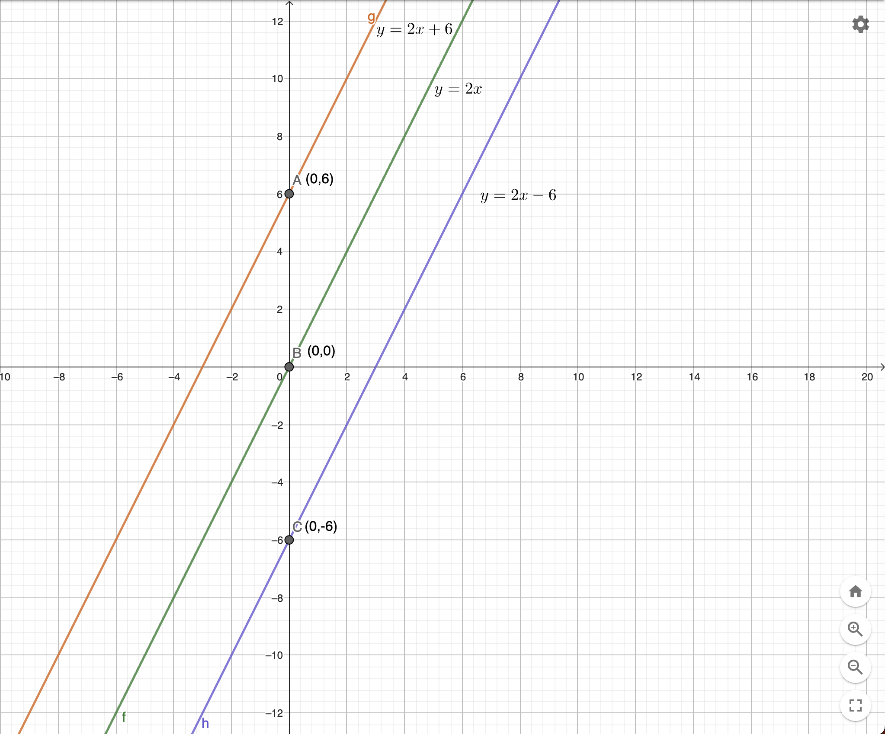

# 基础数学

## 分数

### 扩分 


<font color="#5073D6">分子和分母同时乘以一个非0的数，值不变</font>

如$\frac13=\frac{1\times 2}{3\times2}=\frac{1\times 3}{3\times3}=\frac{1\times 4}{3\times4}$


### 约分 


<font color="#5073D6">分子和分母同时除以一个非0的数，值不变</font>

如$\frac{1}{2}=\frac{2÷2}{4÷2}=\frac{4÷4}{8÷4}=\frac{8÷8}{16÷8}$​


### 比较大小 

1. <font color="#5073D6">分母相同，分子越大值越大</font> 

   如: $\frac{3}{5}>\frac{2}{5}$

2. <font color="#5073D6">分子相同，分母越大值越小</font> 

   如$\frac{3}{5}<\frac{3}{4}$

3. <font color="#5073D6">分母、分子都不同，一般先化为同分母再比较大小</font> 

   如$\frac{3}{4}、\frac{4}{5}$

   $\frac{3}{4}=\frac{3\times 5}{4\times 5}=\frac{15}{20}$​

   $\frac{4}{5}=\frac{4\times 4}{5\times 4}=\frac{16}{20}$​

   因为$\frac{15}{20}<\frac{16}{20}$，所以$\frac{3}{4}<\frac{5}{4}$

   

### 真分数和假分数

真分数：分子小于分母，如$\frac34$

假分数：分子大于或等于分母，如$\frac43$

整数也可以看成假分数，如$1=\frac{2}{2}、2=\frac{4}{2}$


### 带分数 

带分数由<font color="#5073D6">整数</font>和<font color="#5073D6">真分数</font>组成

如：$3\frac{3}{4}$，读作“3又4分之3”

$3\frac{3}{4}=3+\frac{3}{4}=\frac{12}{4}+\frac34=\frac{15}{4}$


### 倒数 

数学上设一个数x与其相乘的积为1的数，记为1/x，过程为“乘法逆元”，除了0以外的数都存在倒数，分子和分母相倒并且两个乘积是1的数互为倒数，0没有倒数。

<font color="#5073D6">简单理解为把一个数的分子、分母颠倒位置</font>

如：$\frac34的倒数是\frac43、2=\frac21的倒数是\frac12$

一个数与其倒数的乘积是1，如：

$\frac34 \times \frac43=1、2 \times \frac12=1$


### 分数的加减法 

1. <font color="#5073D6">同分母：分母不变，分子相加减</font>

   如：$\frac35+\frac15=\frac{3+1}5=\frac45$

   $\frac35-\frac15=\frac{3-1}5=\frac25$

2. <font color="#5073D6">异分母：先化为同分母，然后再按同分母方法计算</font> 

   $\frac45+\frac34=\frac{16}{20}+\frac{15}{20}=\frac{16+15}{20}=\frac{31}{20}$

   $\frac45-\frac34=\frac{16}{20}-\frac{15}{20}=\frac{16-15}{20}=\frac{1}{20}$


### 分数乘法


### 分数除法 


## 负数

### 为什么要引入负数

**我们来思考以下几个问题：**

<ul style="color: #5073D6;">
  <li>温度</li>
</ul>
​	武汉市的气温是30℃，<font color="#5073D6">记气温30℃</font>

​	哈尔滨的气温是零下30℃，<font color="#FC605C">**怎么记录气温？**</font>

<ul style="color: #5073D6;">
  <li>海拔</li>
</ul>
​	珠穆朗玛峰高于海平面8848.86米，<font color="#5073D6">记海拔8848.86米</font>

​	吐鲁番盆地低于海平面154.31米，<font color="#FC605C">**怎么记录海拔？**</font>

<ul style="color: #5073D6;">
  <li>收入</li>
</ul>
​	A公司今年赚了100万元，<font color="#5073D6">即收入100万</font>	

​	B公司今年亏了100万元，<font color="#FC605C">**怎么记录收入？**</font>	

以上三个问题，我们都可以用负数来记录，**负数的引入可以帮助我们表示相反意义的量**


### 怎样表示负数

两个符号：

<ul style="color: #5073D6;">
  <li>+</li>
</ul>
​	<font color="#5073D6">在描述数字时读作“正”</font>，如：

​	   +1、+2、+3；对于正数，一般情况下会省略'+'号，直接书写1、2、3

<ul style="color: #5073D6;">
  <li>-</li>
</ul>
​	<font color="#5073D6">在描述数字时读作“负”</font>，如：

​	   -1、-2、-3，书写时不能省略符号	

写法是在<font color="#5073D6">正数</font>前加上"<font color="#5073D6">-</font>"，读作<font color="#5073D6">负</font>

<font color="#FC605C">注意：0既不是正数也不是负数，即没有+0，-0的写法</font>


### 相反数

<ul style="color: #5073D6;">
  <li>认识数轴</li>
</ul>


1. 数轴上的数是从左到右递增排列的
2. 0的左边全是负数，0的右边全是正数
3. 数轴上每一个正数都有唯一一个负数与之对应

<ul style="color: #5073D6;">
  <li>定义</li>
</ul>
​	当两个数<font color="#5073D6">符号相反</font>且<font color="#5073D6">数字相同</font>时，称这两个数互为相反数。如<font color="#5073D6">1和-1、2和-2、	3和-3</font>

<ul style="color: #5073D6;">
  <li>神奇的-1</li>
</ul>
 1. 除0以外，任何一个数乘以<font color="#5073D6">-1</font>，相当于给这个数加上了一个<font color="#5073D6">负号</font>，如：

    $1 \times (-1) = -1$

    $2 \times (-1) = -2$

 2. 任何一个数与<font color="#5073D6">-1</font>的乘积，都等于这个数的相反数，如：

    1的相反数等于 $1 \times (-1) = -1$

    2的相反数等于 $2 \times (-1) = -2$

    -3的相反数等于$-3 \times (-1) = 3$​​

    <font color="#FC605C">注：</font>

    <font color="#FC605C">1：任何数前面添加‘-’后，都等于这个数的相反数</font>，如

    ​	$-(+2)$  →  $-2$

    ​	$-(-3)$  →  3

    <font color="#FC605C">2：任何数前面添加‘+’后，都等于这个数本身</font>，如

    ​	$+1 = 1$

    ​	$+2 = 2$

    ​	$+(-3) = -3$

 3. 互为相反数的两个数，它们的和等于0，如：

    $1 + (-1) = 0$

    $2 + (-2) = 0$

    $3 + (-3) = 0$​ 
    
    

### 负数的加法和减法运算

<ul style="color: #5073D6;">
  <li>加上一个负数相当于减去这个数的相反数</li>
</ul>
​	$5 + (-3)$，这里的$+(-3) = -3$，所以$5 + (-3)$相当于$5 - 3$

<ul style="color: #5073D6;">
  <li>减去一个负数相当于加上这个数的相反数</li>
</ul>
​	$5 - (-3)$，这里的$-(-3) = 3$，所以$5 - (-3)$相当于$5 + 3$	


### 负数的乘法和除法运算

<ul style="color: #5073D6;">
  <li>一个正数与一个负数的积或商是负数</li>
</ul>
​	$3 \times (-2)$，这里的$-2 = -1 \times 2$，所以$3 \times (-2)$相当于$3 \times 2 \times (-1)$，也相当于$6 \times (-1) = -6$

<ul style="color: #5073D6;">
  <li>两个负数的积或商是正数</li>
</ul>

​	$(-3) \times (-2)$，这里的$-3 = -1 \times 3，-2 = -1 \times 2$，所以$(-3) \times (-2)$相当于$(-1) \times 3 \times (-1) \times 2$，也相当于$(-1)\times(-1)\times6 = 6$


## 幂

### 什么是幂？

通常<font color="#5073D6">幂</font>是指一个数自乘若干次的形式，如：<font color="#5073D6" size="5">$a^n = a \times a \times a \times ... \times a$</font>，这里有<font color="#5073D6">n个a自乘</font>

我们称<font color="#5073D6">a为底数、n为指数、$a^n$为a的n次幂或a的n次方</font>

例如：<font color="#5073D6" size="5">$2^3=2\times2\times2$</font>，这时$a=2、n=3$

注：以上幂的表达式其实是默认<font color="#FC605C">指数n为正整数</font>的情形，当n不是正整数时，幂的表达式是怎样的呢？

<font color="#FC605C" size="5">$2^{-3} = ?$</font>

<font color="#FC605C" size="5">$2^0 = ?$</font>

<font color="#FC605C" size="5">$2^{\frac12} = ?$</font>

上述幂的表达式中<font color="#FC605C">指数n分别等于-3、0、$\frac12$</font>


### 对指数n进行讨论

1. 指数n为正整数

   <font color="#5073D6" size="5">$a^n = a \times a \times a \times ... \times a$</font>，表示n个a相乘

   特别的，当$n=2$时，我们也称$a^2$为a的平方；当$n=3$时，我们也称$a^3$为a的立方

2. 指数n为0

   当底数$a$不为0时，<font color="#5073D6" size="5">$a^0=1$</font>

   如：<font color="#5073D6" size="5">$2^0=1、(-3)^0=1、\frac14^0=1等$</font>

3. 指数n为负整数

   <font color="#5073D6" size="5">$a^n = \frac1a \times \frac1a \times \frac1a \times ... \times \frac1a=\frac{1}{a^n}$</font>，表示n个$\frac1a$相乘

   例如：<font color="#5073D6" size="5">$2^{-3} = \frac12\times\frac12\times\frac12=\frac{1}{2^3}$</font>

4. 指数n为分数时

   <font color="#5073D6">这里我们先讨论n的分子是1，分母是正整数的情形，如$n等于\frac12、\frac13、\frac14等$</font>

   假设$n=\frac1m$，m为正整数（2、3、4等）

   <font color="#5073D6" size="5">$a^{\frac1m} =\sqrt[m]{a}$</font>，表示a的m次方根，指的是<font color="#5073D6">谁的m次方等于a</font>

   特别的，当$n=\frac12$时，<font color="#5073D6" size="5">$a^{\frac12} =\sqrt{a}$</font>，表示a的$2$次方根，也称$a$的<font color="#5073D6">平方根</font>，此时$\sqrt[2]{a}$这里的2可以省略，即$\sqrt{a}=\sqrt[2]{a}$

   当$n=\frac13$时，<font color="#5073D6" size="5">$a^{\frac13} =\sqrt[3]{a}$</font>，表示a的$3$次方根，也称$a$的<font color="#5073D6">立方根</font>

   例如：$16^{\frac14}$表示的是<font color="#5073D6">谁的4次方等于16</font>，我们知道$2^4=16且(-2)^4=16$，所以$16^{\frac14}=\sqrt[4]16=2和-2$

   $27^{\frac13}$表示的是<font color="#5073D6">谁的3次方等于27</font>，我们知道$3^3=27$，所以$27^{\frac13}=\sqrt[3]27=3$

   $16^{\frac12}$表示的是<font color="#5073D6">谁的2次方等于16</font>，我们知道$4^2=16且(-4)^2=16$，所以$16^{\frac12}=4和-4$


### 幂的运算规则

1. 同底数幂的乘法

   <font color="#5073D6" size="5">$a^m\times a^n=a^{m+n}$</font>

   规则：幂$a^m$与幂$a^n$有相同的底数$a$，此时两个幂相乘时，底数$a$不变，指数相加

   例如：$2^3\times 2^4 = 2^{3+4}=2^7=128$

2. 同底数幂的除法

   <font color="#5073D6" size="5">$a^m ÷ a^n=a^{m-n}$</font>

   规则：幂$a^m$与幂$a^n$有相同的底数$a$，此时两个幂相除时，底数$a$不变，指数相减

   例如：$2^4÷ 2^3 = 2^{4-3}=2$

3. 幂的幂

​		<font color="#5073D6" size="5">$(a^m)^n=a^m\times a^m \times a^m ... \times a^m$</font>，即有n个$a^m$相乘

​    	<font color="#5073D6" size="5">$(a^m)^n=a^m\times a^m \times a^m ... \times a^m = a^{m + m + ... + m} = a^{m\times n}$</font>

​	例如：$(3^2)^3 = 3^2 \times3^2 \times3^2 = 3^{2+2+2}=3^6=729$

4. 积的幂

​		<font color="#5073D6" size="5">$(a\times b \times c)^m = a^m \times b^m \times c^m$</font>

​		规则：当一个幂是由多个数的乘积组成时，可以将这些数分别算幂再相乘

​		例如：$(2 \times 3 \times 4)^2 = 2^2 \times 3^2 \times 4^2 = 576$


### 指数n为任意分数

假设$n=\frac qp，p和q为非0整数$

<font color="#5073D6" size="5">$a^{\frac qp}=?$</font>

推导一下

<font color="#5073D6" size="5">$a^{\frac qp}=(a^q)^{\frac 1p}=\sqrt[p]{a^q}$</font>

例如：$8^{\frac23} = \sqrt[3]{8^2} = \sqrt[3]{64} = 4$


## 自然数、整数、有理数、无理数和实数

### 自然数

指<font color="#5073D6">大于或等于0的整数</font>，用数码0、1、2、3、4....表示；它是由0开始，一个接着一个组成的一个无穷集合

<font color="#5073D6">最小的自然数是0</font>

<font color="#5073D6">不存在最大的自然数</font>


### 整数

由<font color="#5073D6">自然数以及负整数</font>（-1、-2、-3...）组成的集合

<font color="#5073D6">整数不存在最大值和最小值</font>


### 有理数

#### 名字的由来

有理数一词是从西方传来，在英语中是rational number，而rational通常的意义是“理性的”；而这个词的词源来自于古希腊，它的英文词根为ratio，就是比率的意思；描述的就是整数的“比”；所以有理数并不表示比别的数更“有道理”，这是一个翻译上的失误；与之相对，“无理数”就是不能精确表示为两个整数之比的数。

#### 定义

指可以表示为<font color="#5073D6">两个整数比（即分数形式）的数；包括整数（整数也可看作是分母是1的分数）、分数以及0</font>；有理数也可以表示为<font color="#5073D6">有限小数</font>和<font color="#5073D6">无限循环小数</font>


### 无理数

无理数也称为<font color="#5073D6">无限不循环小数</font>，不能表示为两个<font color="#5073D6">整数</font>之比的形式。

#### 常见的无理数


### 实数

实数，是<font color="#5073D6">有理数</font>和<font color="#5073D6">无理数</font>的总称


# 进制与转换

## 进位计数制

### 进制三要素

* 数码

  数制中可以表示的数字

* 基数

  数码的个数

* 位权

  基数的数位次方

**以十进制、二进制、八进制、十六进制举例**

1. 十进制

   <font color="#5073D6">数码：0、1、2、3、4、5、6、7、8、9</font>

   <font color="#5073D6">基数：10</font>

   <font color="#5073D6">位权：</font>以十进制数1024为例

   ​	

2. 二进制

   <font color="#5073D6">数码：0、1</font>

   <font color="#5073D6">基数：2</font>

   <font color="#5073D6">位权：</font>以二进制数1010为例

   ​           

3. 八进制

   <font color="#5073D6">数码：0、1、2、3、4、5、6、7</font>

   <font color="#5073D6">基数：8</font>

   <font color="#5073D6">位权：</font>以八进制数6742为例

​	          

4. 十六进制

   <font color="#5073D6">数码：0、1、2、3、4、5、6、7、8、9、A、B、C、D、E、F</font>

   <font color="#5073D6">基数：16</font>

   <font color="#5073D6">位权：</font>以十六进制数28DF为例

   ​                 


### 数码组合

数码组合指的是以<font color="#5073D6">数码</font>的排列组合方式描述一个数，如：

<font color="#5073D6">十进制数1024</font>  它是由<font color="#5073D6">十进制数码0、1、2、4</font>这四个数码排列组合而成；

<font color="#5073D6">二进制数$(1010)_2$</font>  它是由<font color="#5073D6">二进制数码0、1</font>这两个数码排列组合而成；

<font color="#5073D6">八进制数$(6742)_8$ </font>  它是由<font color="#5073D6">八进制数码2、4、6、7</font>这四个数码排列组合而成；

<font color="#5073D6">十六进制数$(28DF)_{16}$ </font> 它是由<font color="#5073D6">十六进制数码2、8、D、F</font>这四个数码排列组合而成；


### 位权组合

位权组合指的是用<font color="#5073D6">位权累加</font>的方式描述一个数，如：

<font color="#5073D6">$十进制数1024=1\times 10^3 + 0 \times 10^2 + 2 \times 10^1 + 4 \times 10^0$​</font>

<font color="#5073D6">$二进制数(1010)_2=1\times 2^3 + 0 \times 2^2 + 1 \times 2^1 + 0 \times 2^0$</font>

<font color="#5073D6">$八进制数(6742)_8=6\times 8^3 + 7 \times 8^2 + 4 \times 8^1 + 2 \times 8^0$</font>

<font color="#5073D6">$十六进制数(28DF)_{16}=2\times 16^3 + 8 \times 16^2 + 13 \times 16^1 + 15 \times 10^0$</font>


## 非十进制数转十进制数

规则：将一个非十进制数以<font color="#5073D6">位权组合</font>的方式表示，然后将每个位权部分按十进制方式计算，最后求和。

<font color="#5073D6" size="6">**十进制数998.25**</font>


<font color="#5073D6" size="4">**$998.25=9\times 10^2 + 9\times 10^1 + 8\times 10^0 + 2\times 10^{-1} + 5\times 10^{-2}$**</font>


<font color="#5073D6" size="6">**二进制数$(110.011)_2$**</font>


<font color="#5073D6" size="4">**$(110.011)_2=1\times 2^2 + 1\times 2^1 + 0\times 2^0 + 0\times 2^{-1} + 1\times 2^{-2} + 1\times 2^{-3}=6.375$**</font>


<font color="#5073D6" size="6">**八进制数$(754)_8$**</font>


<font color="#5073D6" size="4">**$(754)_8=7\times 8^2 + 5\times 8^1 + 4\times 8^0=492$**</font>


<font color="#5073D6" size="6">**十六进制数$(28DF)_{16}$**</font>

<font color="#5073D6" size="4">**$(28DF)_{16}=2\times 16^3 + 8\times 16^2 + 13\times 16^1 + 15\times 16^0=10463$**</font>


## 十进制整数转非十进制整数

### 除基倒序取余法

1. 反复除以基数得到商和余数
2. 商继续除基数直到为0为止
3. 余数倒序即为结果

<font color="#5073D6" size="5">**十进制数转二进制数**</font>

<font color="#5073D6" size="5">**$13=(1101)_2$​**</font>


<font color="#5073D6" size="5">**十进制数转八进制数**</font>

<font color="#5073D6" size="5">**$127=(177)_8$**</font>


<font color="#5073D6" size="5">**十进制数转十六进制数**</font>

<font color="#5073D6" size="5">**$127=(7F)_{16}$**</font>


  

### 按位权拆分法

<font color="#5073D6">相当于将十进制数用其它进制的位权组合表示，然后根据位权组合写出对应的数码组合</font>



$13 = 8 + 4 + 1 = $<font color="#5073D6">1</font>$\times 2^3 + $<font color="#5073D6">1</font>$\times 2^2 + $<font color="#5073D6">0</font>$ \times 2^1 + $<font color="#5073D6">1</font>$\times 2^0 = ($<font color="#5073D6">1101</font>$)_2$

$127 = $<font color="#5073D6">1</font>$\times 8^2 + $<font color="#5073D6">7</font>$\times 8^1 + $<font color="#5073D6">7</font>$ \times 8^0 = ($<font color="#5073D6">177</font>$)_8$

$127 = $<font color="#5073D6">7</font>$\times 16^1 + $<font color="#5073D6">15</font>$ \times 16^0 = ($<font color="#5073D6">7F</font>$)_{16}$​


## 十进制小数转非十进制小数

十进制小数转换成二进制小数采用<font color="#5073D6">**乘2取整，顺序排列**</font>法。具体做法是：用2乘十进制小数，可以得到积，将积的整数部分取出，再用2乘余下的小数 部分，又得到一个积，再将积的整数部分取出，如此进行，直到积中的小数部分为零，或者达到所要求的精度为止。

然后把取出的整数部分按顺序排列起来，先取的整数作为二进制小数的高位有效位，后取的整数作为低位有效位。

<font color="#5073D6">$(0.8125)_2$转换为二进制小数</font>


<font color="#5073D6">十进制小数转换成八进制、十六进制小数也是类似的；采用乘8或16取整，顺序排列法</font>


## 二进制数与八进制数转换

<font color="#5073D6">三位二进制数共能表示0、1、2、3、4、5、6、7八个数字，它们与八进制数一一对应</font>

<font color="#5073D6">$(000)_2=(0)_8$</font>  	<font color="#5073D6">$(001)_2=(1)_8$</font>	<font color="#5073D6">$(010)_2=(2)_8$</font>	<font color="#5073D6">$(011)_2=(3)_8$</font>

<font color="#5073D6">$(100)_2=(4)_8$</font>  	<font color="#5073D6">$(101)_2=(5)_8$</font>	<font color="#5073D6">$(110)_2=(6)_8$</font>	<font color="#5073D6">$(111)_2=(7)_8$</font>

* 二进制数转八进制数

  1. 将二进制数从右向左，每3个一组进行划分，不足3个时，向最左边添加0

     <font color="#5073D6" size="5">$(11100100)_2 = $</font>  <font color="#5073D6" size="5">(</font><font color="#FC605C" size="5">$0$</font><font color="#5073D6" size="5">$11,100,100)_2$</font> 

  2. 将每组二进制数转为八进制数

     <font color="#5073D6" size="5">(</font><font color="#FC605C" size="5">$0$</font><font color="#5073D6" size="5">$11,100,100)_2$</font> <font color="#5073D6" size="5">$=(344)_8$</font>

* 八进制数转二进制数

  1. 将八进制数的每一位拆分为三位二进制数

     <font color="#5073D6" size="5">$(136)_8$</font><font color="#5073D6" size="5">$=($</font><font color="#FC605C" size="5">$00$</font><font color="#5073D6" size="5">$1,$</font><font color="#5073D6" size="5">$011,110)_2$</font>

  2. 将二进制数最左边多余的0去掉

​		<font color="#5073D6" size="5">$($</font><font color="#FC605C" size="5">$00$</font><font color="#5073D6" size="5">$1,$</font><font color="#5073D6" size="5">$011,110)_2$</font><font color="#5073D6" size="5">$=(1011110)_2$</font>


## 二进制数与十六进制数转换

<font color="#5073D6">四位二进制数共能表示0、1、2、3、4、5、6、7、8、9、A、B、C、D、E、F十六个数字，它们与十六进制数一一对应</font>

<font color="#5073D6">$(0000)_2=(0)_{16}$</font>  	<font color="#5073D6">$(0001)_2=(1)_{16}$</font>		<font color="#5073D6">$(0010)_2=(2)_{16}$</font>		<font color="#5073D6">$(0011)_2=(3)_{16}$</font>

<font color="#5073D6">$(0100)_2=(4)_{16}$</font>  	<font color="#5073D6">$(0101)_2=(5)_{16}$</font>		<font color="#5073D6">$(0110)_2=(6)_{16}$</font>		<font color="#5073D6">$(0111)_2=(7)_{16}$</font>

<font color="#5073D6">$(1000)_2=(8)_{16}$</font>  	<font color="#5073D6">$(1001)_2=(9)_{16}$</font>		<font color="#5073D6">$(1010)_2=(A)_{16}$</font>		<font color="#5073D6">$(1011)_2=(B)_{16}$</font>

<font color="#5073D6">$(1100)_2=(C)_{16}$</font>  	<font color="#5073D6">$(1101)_2=(D)_{16}$</font>		<font color="#5073D6">$(1110)_2=(E)_{16}$</font>		<font color="#5073D6">$(1111)_2=(F)_{16}$</font>

* 二进制数转十六进制数

  1. 将二进制数从右向左，每4个一组进行划分，不足4个时，向最左边添加0

     <font color="#5073D6" size="5">$(1011100100)_2=($</font><font color="#FC605C" size="5">$00$</font><font color="#5073D6" size="5">$10,1110,0100)_2$​</font>

  2. 将每组二进制数转为十六进制数

     <font color="#5073D6" size="5">$($</font><font color="#FC605C" size="5">$00$</font><font color="#5073D6" size="5">$10,1110,0100)_2$</font><font color="#5073D6" size="5">$=(2E4)_{16}$</font>

* 十六进制数转二进制数

  1. 将十六进制数的每一位拆分为四位二进制数

     <font color="#5073D6" size="5">$(51A)_{16}=($</font><font color="#FC605C" size="5">$0$</font><font color="#5073D6" size="5">$101,0001,1010)_2$</font>

  2. 将二进制数最左边多余的0去掉

​		<font color="#5073D6" size="5">$($</font><font color="#FC605C" size="5">$0$</font><font color="#5073D6" size="5">$101,0001,1010)_2$</font><font color="#5073D6" size="5">$=(10100011010)_2$</font>


# 初等数论

## 整除

### 定义

设<font color="#5073D6">$a,b$是整数</font>，<font color="#5073D6">$b\neq0$</font>. 如果有一个<font color="#5073D6">整数$c$</font>，它使得<font color="#5073D6">$a=b\times c$</font>，则<font color="#5073D6">$a$叫做$b$的倍数，$b$叫做$a$的因数</font>，这时我们说，<font color="#5073D6">b能整除a或a能被b整除</font>，我们用符号<font color="#5073D6">b|a</font>来表示这种整除关系.

即: <font color="#5073D6" size="6">$\frac{a}{b}或a÷b$</font>

* a，b是整数

* b不等于0

* $\frac{a}{b}或a÷b的余数为0$

* a是b的倍数

* b是a的因数

  

### 绝对值

任意一个实数$a$，我们用记号$|a|$来表示：
$$
|a|=\left\{
\begin{aligned}
a, a\geq0\\
-a, a<0
\end{aligned}
\right.
$$
<font color="#5073D6">$|a|叫做a的绝对值$</font>

如：$|2|=|-2|=2$


### 引理

<font color="#5073D6">以下引理需要记忆，不要求证明</font>

1. 如果a,b是两个整数并且满足a|b，则$(-a)|b、a|(-b)、(-a)|(-b)、|a|||b|$

   $如$a=3,b=9$，有$3|9$，则(-3)|9、3|(-9)、(-3)|(-9)、|3|||9|$

2. 如果$a，b，c$都是整数并且$a|b，b|c$，则有$a|c$

   $如a=3,b=9,c=18$，$3|9，9|18$，则$3|18$

3. 如果$a，b$都是整数并且$|a|<|b|，|b|||a|$，则有$a=0$

   $如a=0，b=-5$

4. <font color="#5073D6">如果$a,b$是整数，$b\neq 0$，则一定有并且只有两个整数$q，r$，可使</font>

   <font color="#5073D6">$a = b\times q + r，0\leq r \leq|b|$，成立</font>

   $如a = 9, b = 3$，则<font color="#5073D6">9 = 3</font>$\times$<font color="#FC605C">3</font> $+$ <font color="#FC605C">0</font>

   $如a = 10, b = 3$，则<font color="#5073D6">10 = 3</font>$\times$<font color="#FC605C">3</font> $+$ <font color="#FC605C">1</font>

   <font color="#FC605C">即两个整数相除，除数不为0时，商和余数是确定且唯一的；这里的a可以看成被除数、b可以看成除数、q可以看成商、r可以看成余数</font>


## 素（质）数与合数

### 定义

一个大于1的正整数，只能被1和它本身整除，不能被其他正整数整除，这样的正整数叫做<font color="#5073D6">素数或者质数</font>

一个正整数除了能被1和本身整除以外，还能被另外的正整数整除，这样的正整数叫做<font color="#5073D6">合数</font>

<font color="#5073D6">**由素数与合数的定义，全体正整数可分为三类：**</font>

<ul style="color: #5073D6;">
  <li>1</li>
</ul>
<ul style="color: #5073D6;">
  <li>全体素数</li>
</ul>
<ul style="color: #5073D6;">
  <li>全体合数</li>
</ul>


### 素因数

如果一个正整数a有一个因数b，而b又是素数，则b叫做a的素因数

如$12 = 3 \times 4$，所以3和4都是12的因数，由于3是素数而4不是，所以3是12的素因数

### 引理

<font color="#5073D6">以下引理需要记忆，不要求证明</font>

1. 如果a是一个大于1的整数，则a的大于1的最小因数一定是素数
2. 如果a是一个大于1的整数，而所有$\leq \sqrt a$​的素数都除不尽a，则a是素数
3. 有无限多个素数

### 目前已知的最大素数

<font color="#5073D6" size="6">$2^{82589933} - 1$</font>

### 孪生素数


相邻两个素数的差是2，则称这两个素数为孪生素数

### 哥德巴赫猜想


<font color="#5073D6" size="5">**凡是大于4的偶数都可以表示为两个素数之和？**</font>


## 整数唯一分解定理

### 定理

任何一个大于1的自然数n，都可以唯一分解成有限个质数的乘积，写作$n=p_1^{a_1} \times p_2^{a_2} \times ... \times p_m^{a_m}$，表示n有m种不同的质因数，每种质因数有$a_i$个。

当$p_1、p_2...、p_m$从小到大排列时，我们把<font color="#5073D6">$n=p_1^{a_1} \times p_2^{a_2} \times ... \times p_m^{a_m}$</font>叫做$n$的标准分解式，如：

$600的标准分解式: 600=2^3\times 3^1 \times 5^2$​​

$117的标准分解式: 117=3^2 \times 13$

$9828的标准分解式: 9828=2^2\times 3^3 \times 7 \times 13$

$10725的标准分解式: 10725=3\times 5^2 \times 11 \times 13$


### 因数个数

若自然数n可以唯一分解为$p_1^{a_1} \times p_2^{a_2} \times ... \times p_m^{a_m}$，则n的因数个数可以表示为<font color="#5073D6" size="5">$(a_1 +1)\times (a_2 +1) \times ...\times (a_m +1)$</font>

如24的唯一分解为$24=2^3\times 3^1$，则24的因数个数为$(3+1)\times (1+1)=8$


### 因数和

若自然数n可以唯一分解为$p_1^{a_1} \times p_2^{a_2} \times ... \times p_m^{a_m}$，则n的所有因数总和可以表示为

<font color="#5073D6">$(p_1^0 + p_1 ^1 + ... + p_1^{a_1})\times (p_2^0 + p_2 ^1 + ... + p_2^{a_2})\times ... \times (p_m^0 + p_m ^1 + ... + p_m^{a_m})$</font>

如24的唯一分解为$24=2^3\times 3^1$，则24的所以因数总和为$(2^0 + 2^1 + 2^2 + 2^3)\times (3^0 + 3^1) = 60$


## 最大公因数

### 定义

如果整数$n\geq2$，并且整数$a_1、a_2、...a_n和d$满足$d|a_1,d|a_2,...,d|a_n$，则d叫做$a_1,a_2,...,a_n$的公因数，<font color="#5073D6">公因数中最大的一个叫做$a_1、a_2、...a_n的最大公因数.$</font>

我们写成<font color="#5073D6">$(a_1,a_2,...,a_n)=d$</font>

<font color="#5073D6">**求几个正整数的最大公因数时，先把这些正整数分别分解质因数，然后取出它们所公有的质因数相乘**</font>

求$48、60和72$的最大公因数

$48 = 2 \times 2 \times 2 \times 2 \times 3 = 2^4 \times 3$​

$60 = 2 \times 2 \times 3 \times 5 = 2^2 \times 3 \times 5$​

$72 = 2 \times 2 \times 2 \times 3 \times 3 = 2^3 \times 3^2$

$48、60和72公有的素因数是2,2,3$，它们的乘积就是这三个数的最大公因数：$2\times 2 \times 3 = 12$

<font color="#FC605C">求$1008、1260和882和1134$的最大公因数？</font>


### 引理

<font color="#5073D6">假设a和b都是正整数，且$a\gt b$，$a = b\times q + r$，其中$q$和$r$都是正整数，则$a$和$b$的最大公因数等于$b$和$r$的最大公因数，即$(a,b)=(b,r)$</font>

$求6731和2809的最大公因数$

$6731=2809\times 2 + 1113$

<font color="#5073D6">$(6731,2809) = (2809,1113)$</font>

$2809 = 1113\times 2 + 583$

<font color="#5073D6">$(2809,1113) = (1113,583)$</font>

$1113 = 583 \times 1 + 530$

<font color="#5073D6">$(1113,583) = (583,530)$</font>

$583=530+53$

<font color="#5073D6">$(583,530)=(530, 53)$​</font>

$530=53\times 10 + 0$

<font color="#5073D6">$(530, 53)=53$</font>

<font color="#5073D6">**$所以(6731,2809)=(530, 53)=53$**</font>

<font color="#FC605C">**以上求最大公约数的方法叫做辗转相除法**</font>

当求3个及以上正整数，如$a_1，a_2,...,a_n$的最大公约数时，采取以下办法：

* 先求$a_1和a_2的最大公因数，假设是b_1$
* 再求$b_1和a_3的最大公因数，假设是b_2$
* 则$b_2$就是$a_1、a_2、a_3$的最大公因数

当$n\geq 4$时，以此类推

<font color="#FC605C">如求$(27090,21672,11352,8127)?$</font>


## 最小公倍数

### 定义

如果整数$n\geq 2$，并且$a_1，a_2,...,a_n$和m都是正整数，又$a_1|m，a_2|m，...,a_n|m$，则m叫做$a_1,a_2,...,a_n$的公倍数，在$a_1，a_2,...,a_n$所有的公倍数中，最小的一个公倍数叫做$a_1，a_2,...,a_n$的最小公倍数，我们<font color="#5073D6">写作$\{a_1,a_2,...,a_n\}=m$</font>

如$\{4,6\}=12$

如果<font color="#5073D6">求n个正整数$a_1,a_2,...,a_n$的最小公倍数</font>，可先将它们分解成标准分解式<font color="#5073D6">$p_1^{a_1} \times p_2^{a_2} \times ... \times p_m^{a_m}$</font>，然后找出所有$p_i^{a_i+1}$，要满足它不能整除所有的$a_1,a_2,...,a_n$，最后将所有$p_i^{a_i}$相乘，就得到这n个数$a_1,a_2,...,a_n$的最小公倍数

<font color="#5073D6">求$108,28和42$的最小公倍数</font>

$108=$<font color="#FC605C">$2^2$</font>$\times$ <font color="#FC605C">$3^3$</font>

$28=2^2\times$ <font color="#FC605C">$7$</font>

$42=2\times 3 \times 7$

可以发现$2^{2+1}、3^{3+1}、7^{1+1}$都不能整除$108、28、42$，所以<font color="#5073D6">$108,28和42$的最小公倍数是：</font><font color="#FC605C">$2^2$</font>$\times$ <font color="#FC605C">$3^3$</font> $\times$ <font color="#FC605C">$7$</font> = <font color="#FC605C">$756$</font>


 ### 互素

如果整数$n\geq 2$，并且$a_1，a_2,...,a_n$都是正整数，如果这些正整数的最大公因数是1，即$(a_1，a_2，...,a_n)=1$，我们称$a_1,a_2,...,a_n$是互素的

如$(6, 10, 15)=1$

#### 引理1

如果整数$n\geq 2$，并且$a_1，a_2，...,a_n$两两互素，则这n个正整数的最小公倍数就是这n个数的乘积.

如$15,32,49$两两互素，则$\{15,32,49\}=15 \times 32 \times 49 = 23520$

#### 引理2

假设$a和b$都是正整数，并且$a和b$的最小公倍数是$m$，即$\{a,b\}=m$，如果$m^{'}$是$a和b$的公倍数，则有$m|m^{'}$

<font color="#5073D6">即最小公倍数与其它公倍数满足整除的关系</font>

#### 引理3

假设$a和b$都是正整数，并且$a和b$的最小公倍数是$m$，$a和b$的最大公因数是$d$，即$\{a,b\}=m,(a,b)=d$，则$a\times b = d\times m$

<font color="#5073D6">即两个正整数的乘积等于这两个数的最小公倍数与最大公因数的乘积</font>


## 模运算与同余

### 模运算

<font color="#5073D6">目的是求两个数相除的余数</font>；在模运算中给定两个数a和b（b不等于0），模运算的结果是a除以b后得到的余数，通常表示为<font color="#5073D6">a mod b或a % b</font>

如：11除以2的余数是1，所以11 mod 2或11 % 2的结果是1


### 同余

#### 概念

两个整数a和b除以同一个正整数m，得到的余数相等，则称a和b对模m同余

#### 定义

如果a和b都是整数，对于一个固定的整数m，当<font color="#5073D6">$m|(a-b)$</font>时，我们说a，b对模m同余，<font color="#5073D6">记作a≡b(mod m)</font>

如：$29≡2(mod\ 9)、93≡-7(mod\ 50)$

由于$29-2=27=3\times 9$，所以有$29≡2(mod\ 9)$

由于$93-(-7)=100=2\times 50$，所以有$93≡-7(mod\ 50)$

#### 引理1

如果$a,b,c$​都是整数，m是一个正整数，则当

$a≡b(mod\ m)$

$b≡c(mod\ m)$​

都成立时，我们有<font color="#5073D6">a≡c(mod m)</font>

如：$3≡5(mod\ 2)、5≡7(mod\ 2)$，那么$3≡7(mod\ 2)$

####  引理2

$如果a,b,c,d$都是整数，而m是一个正整数，则当

$a≡b(mod\ m)$

$c≡d(mod\ m)$​

都成立时，我们有

<font color="#5073D6">a+c≡b+d(mod m)</font>

<font color="#5073D6">a-c≡b-d(mod m)</font>

<font color="#5073D6">axc≡bxd(mod m)</font>

如：$22≡26(mod\ 4)、9≡13(mod\ 4)$，那么$22+9≡26+13(mod\ 4)、22-9≡26-13(mod\ 4)、22\times 9≡26\times 13(mod\ 4)$

#### 引理3

如果$a,b,c$都是整数，m是一个正整数，则当

$a≡b(mod\ m)$

成立时，我们有<font color="#5073D6">ac≡bc(mod m)</font>

如：$3≡5(mod\ 2)$，那么$3\times 7≡5\times 7(mod\ 2)$

#### 引理4

如果$a,b$都是整数，而$m，n$都是正整数，则当

$a≡b(mod\ m)$

成立时，我们有<font color="#5073D6">$a^n≡b^n(mod\ m)$</font>

如：$3≡5(mod\ 2)$，那么$3^3≡5^3(mod\ 2)$

#### 引理5

如果$a_1,a_2,...,a_n,b_1,b_2,...,b_n$都是整数，$m,n$都是正整数，则当

$a_1≡b_1(mod\ m)$

$a_2≡b_2(mod\ m)$​

...

$a_n≡b_n(mod\ m)$

都成立时，我们有

<font color="#5073D6">$a_1+a_2+...+a_n≡b_1+b_2+...+b_n(mod\ m)$</font>

如：

$5≡8(mod\ 3)$

$11≡14(mod\ 3)$

$17≡23(mod\ 3)$​

那么<font color="#5073D6">$5+11+17≡8+14+23(mod\ 3)$</font>


<font size="6">$5874192$能否被$9$整除?</font>

$5874192=5\times 10^6+8\times 10^5+7\times 10^4+4\times 10^3+10^2+9\times 10+2$​

我们知道$10≡1(mod\ 9)$

由<font color="#5073D6">引理4</font>，我们知道$10^n≡1^n(mod\ 9)$，即$10^n≡1(mod\ 9)$​

由<font color="#5073D6">引理3</font>，我们知道$5\times 10^6=5(mod9)$、$8\times 10^5=8(mod9)$、$7\times 10^4=7(mod9)$、$4\times 10^3=4(mod9)$、$10^2=1(mod9)$、$9\times 10=9(mod9)$

由<font color="#5073D6">引理5</font>，我们知道$5\times 10^6+8\times 10^5+7\times 10^4+4\times 10^3+10^2+9\times 10+2≡5+8+7+4+1+9+2(mod\ 9)$

即$5874192≡5+8+7+4+1+9+2(mod\ 9)$

由于$5+8+7+4+1+9+2=36，能被9整除，所以5874192能被9整除$


#### 性质

* <font color="#5073D6">和的余数等于余数的和</font>

  即对于正整数$a，b和n$，按照模运算的定义，我们可以表示：

  $a≡r_a(mod\ n)$，其中$r_a$是$a$除以$n$的余数，即：

  $a=q_a\times n +r_a$，其中$q_a$是商，$0\leq r_a\lt n$。

  类似地，对于另一个整数$b$，我们有：

  $b≡r_b(mod\ n)$，即$b=q_b\times n +r_b$

  $a+b=(q_a\times n +r_a)+(q_b\times n +r_b)=(q_a+q_b)\times n + (r_a+r_b)$

  因此，$a+b$除$n$后的余数，应该是$r_a+r_b$除$n$后的余数，即：

  $(a+b)mod\ n=(r_a+r_b)mod\ n$

  

* <font color="#5073D6">积的余数等于余数的积</font>

  假设有一个正整数 $n$，然后考虑两个整数 $a$ 和 $b$。按照模运算的定义，我们可以表示：

  $a≡r_a(mod\ n)$，其中$r_a$是$a$除以$n$的余数，即：

  $a=q_a\times n +r_a$

  同理，对于整数 $b$​，我们有：

  $b≡r_b(mod\ n)$，即$b=q_b\times n +r_b$

  $a\times b=(q_a\times n+r_a)\times (q_b\times n+r_b)$

  展开后得到：

  $a\times b=q_a\times q_b\times n^2+q_a\times r_b\times n+q_b\times r_a\times n+r_a\times r_b$​

  从中可以看出，前面几项都包含 $n$ 的倍数，所以这些项在模 $n$ 时余数为 0。因此，以上表达式模 $n$ 的结果主要由最后一项$r_a\times r_b$决定：

  $(a\times b)\ mod\ n=r_a\times r_b\ mod\ n$


# 组合数学


## 加法原理

也叫<font color="#5073D6">分类加法计数原理</font>

指的是在完成一个目标时可以有n类方法，在第一类方法中有$m_1$种不同的方法，在第二类方法中有$m_2$种不同的方法，以此类推，在第$n$类方法中有$m_n$种不同的方法，那么完成这个目标共有$N$中方法。

<font color="#5073D6" size="5">$N=m_1+m_2+...+m_n$</font>

<font size="5">例1</font>

从武汉到上海有<font color="#5073D6">乘飞机、火车、轮船3种交通工具</font>，而飞机有<font color="#5073D6">a个班次</font>；火车有<font color="#5073D6">b个班次</font>；轮船有<font color="#5073D6">c个班次</font>，那么从武汉到上海共有<font color="#5073D6">$a+b+c$</font>种方式


从武汉到上海有3类方法，每类方法有3个方法

<font color="#5073D6">根据加法原理：$N=3+3+3=9$种</font>

<font size="5">例2</font>

书架上有不同的数学书5本，不同的物理书4本，不同的化学书3本，从中任取一本，有多少种不同的取法？

从书架上任取一本书有3类方法：

1. 从5本不同的数学书中选一本，有5种方法
2. 从4本不同的物理书中选一本，有4种方法
3. 从3本不同的化学书中选一本，有3种方法

<font color="#5073D6">根据加法原理：$N=5+4+3=12$种</font>


## 乘法原理

也叫<font color="#5073D6">分步乘法计数原理</font>

乘法原理是指要完成一个目标，需要分成$n$个步骤，做第一步时有$m_1$种不同方法，做第二步时有$m_2$种不同方法，以此类推，做第$n$步时有$m_n$种不同方法，那么完成这件事有$N$种不同方法。

<font color="#5073D6" size="5">$N=m_1\times m_2\times...\times m_n$</font>

<font size="5">例1</font>

从甲地到乙地的道路有3条，有乙地到丙地的道路有2条，要想从甲地途径乙地到丙地，共有多少种不同的走法？


从甲地途径乙地到丙地要分成两个步骤：

1. 从甲地到乙地，有3条路径

2. 从乙地到丙地，有2条路径

<font color="#5073D6">根据乘法原理：$N=3\times 2=6$种</font>

<font size="5">例2</font>

密码锁有3位，每一位可能是0~9中的一个，那么可以设置多少种不同的密码？

设置密码锁分3个步骤：

1. 设置密码锁的第一位，有10种方法
2. 设置密码锁的第二位，有10种方法
3. 设置密码锁的第三位，有10种方法

<font color="#5073D6">根据乘法原理：$N=10\times 10\times 10=10^3$种</font>

<font size="5">例3</font>

4名同学分别报名参加学校的足球队、篮球队、乒乓球队，每人限报其中的一个运动队，不同的报法有多少种？

4个同学报名运动队分4个步骤：

1. 第一名同学报名，有3种报法
2. 第二名同学报名，有3种报法
3. 第三名同学报名，有3种报法
4. 第四名同学报名，有3种报法

<font color="#5073D6">根据乘法原理：$N=3\times 3 \times 3 \times3=3^4种$</font>

<font size="5">例4</font>

2160有多少种不同的正因数?

$2160化为标准分解式为2^4\times 3^3 \times 5^1$

计算2160的正因数个数分为3个步骤：

1. 从$2^4$中取一个因数有$2^0、2^1、2^2、2^3、2^4$，5种取法
2. 从$3^3$中取一个因数有$3^0、3^1、3^2、3^3$，4种取法
3. 从$5^1$中取一个因数有$5^0、5^1$，2种取法

<font color="#5073D6">根据乘法原理正因数个数有：$N_2=5\times 4 \times 2=40种$</font>

<font size="5">例5</font>

从甲地到乙地有2条路；从乙地到丁地有3条路；从甲地到丙地有4条路；从丙地到丁地有2条路。从甲地到丁地共有多少种不同的路线？


从甲地到丁地有2类不同的方法：

1. 甲地经乙地到丁地

   分2个步骤：

   1. 甲地到乙地，有2条路
   2. 乙地到丁地，有3条路

   <font color="#5073D6">根据乘法原理：$N_1=2\times 3=6种$</font>

2. 甲地经丙地到丁地

   分2个步骤：

   1. 甲地到丙地，有4条路
   2. 丙地到丁地，有2条路

​	<font color="#5073D6">根据乘法原理：$N_2=2\times 4=8种$</font>

<font color="#5073D6">根据加法原理从甲地到丁：$N=N_1+N_2=6+8=14$种</font>


## 排列与组合

### 排列

<font size="5">假设有3个字母，分别是a、b、c，现在将这3个字母<font color="#5073D6">按顺序</font>排成一队，请问有多少种排队方法？</font>

<font color="#FC605C"><u>①号位</u> <u>②号位</u> <u>③号位</u></font>

* 枚举法

  * a排一号位

    <font color="#FC605C">a</font> <u>b</u> <u>c</u>

    <font color="#FC605C">a</font> <u>c</u> <u>b</u>

  * b排一号位

    <font color="#FC605C">b</font> <u>a</u> <u>c</u>

    <font color="#FC605C">b</font> <u>c</u> <u>a</u>

  * c排一号位

    <font color="#FC605C">c</font> <u>a</u> <u>b</u>

    <font color="#FC605C">c</font> <u>b</u> <u>a</u>

* 乘法原理

  将a、b、c三个字母按顺序排成一队，要<font color="#5073D6">分为3个步骤</font>

  1. 把①号位分配给a、b、c中的一个，有3种方法
  2. 把②号位分配给剩下两个字母中的一个，有2种方法
  3. 把③号位分配给最后一个字母，有1种方法

  所以根据乘法原理，总共的排队方法有 $3\times 2 \times 1 = 6种$

#### 抽象与推广

将3个字母a、b、c按顺序排成一队，可以抽象为将3个不同元素按顺序排成一队。

我们知道将3个不同元素按顺序排成一队有$3\times 2 \times 1 = 6$种方法；

通过乘法原理，我们同样能够知道，

将4个不同元素按顺序排成一队有$4\times 3\times 2 \times 1 = 24$种

将5个不同元素按顺序排成一队有$5 \times 4\times 3\times 2 \times 1 = 120$种

推广到n个不同元素按顺序排成一队有$n \times (n-1) \times (n-2) \times ... \times 2 \times 1$种

我们将这种n个不同元素<font color="#5073D6">按顺序</font>排成一队，叫做<font color="#5073D6">全排列</font>，用$A_n^n$表示

<font color="#5073D6" size="5">$A_n^n = n \times (n-1) \times (n-2) \times ... \times 2 \times 1$​​</font>

其中$n \times (n-1) \times (n-2) \times ... \times 2 \times 1$也是$n!$，读作“n的阶乘”，所以

<font color="#5073D6" size="5">$A_n^n = n! = n \times (n-1) \times (n-2) \times ... \times 2 \times 1$</font>

如将5个不同元素按顺序排成一队表示为$A_5^5$，有$5 \times 4\times 3\times 2 \times 1 = 120$种


<font size="5">假设我们要从4个不同元素中选出两个按顺序进行排列，请问有多少种排队方法？</font>

<font color="#FC605C"><u>①号位</u> <u>②号位</u> </font>

将4个不同元素中的两个按顺序进行排列，可以分为<font color="#5073D6">两个步骤</font>

1. 把①号位分配给4个元素中的一个，有4种方法
2. 把②号位分配给剩下3个元素中的一个，有3种方法

根据乘法原理，总共的排队方法有$4\times 3 = 12种$

同样的，通过乘法原理，我们能够知道：

从n个不同的元素中，取出m个元素$(m<n)$，按顺序排成一列，有$n \times (n-1) \times (n-2) \times ... \times (n-m+1)$种；

我们将从n个不同的元素中，取出m个元素$(m<n)$，<font color="#5073D6">按顺序</font>排成一列，叫作<font color="#5073D6">选排列</font>，用$A_n^m$表示

<font color="#5073D6" size="5">$A_n^m = n \times (n-1) \times (n-2) \times ... \times (n-m+1)$​</font>

<font color="#5073D6" size="5">$A_n^m = \frac{n \times (n-1) \times (n-2) \times ... \times(n-m+1) \times (n-m) \times... \times 2 \times 1}{(n-m) \times... \times 2 \times 1} = \frac{n!}{(n-m)!}$</font>

如从4个不同元素中选出两个进行排列表示为$A_4^2$，有$4\times 3=12$种方法


### 组合

<font size="5">从4个不同元素中选取两个元素，按顺序进行排列的另一个思考角度</font>

<font color="#5073D6">两步算法</font>

1. 从4个不同元素中选取两个元素
2. 将选取出的两个元素进行全排列

我们知道从4个不同元素中选取两个，按顺序进行排列有$A_4^2$种方法；

1. 假设从4个不同元素中选取两个元素，有n种选法
2. 将选取出的两个元素进行全排列，有$A_2^2$种方法

那么$A_4^2=n \times A_2^2$，则$n=\frac{A_4^2}{A_2^2}$

即从4个不同元素中选取两个元素，有$\frac{A_4^2}{A_2^2}$种选法


现在我们推广到从n个不同元素中选取m$(m \le n)$个元素为一组，那么总组合数是多少？

1. 假设从n个不同元素中选取m个元素，有N种选法
2. 将选取出的m个元素进行全排列，有$A_m^m$​种方法

根据乘法原理，从n个不同元素中选取m$(m \le n)$个元素，<font color="#5073D6">按顺序</font>排成一列有$A_m^m \times N$种

根据<font color="#5073D6">选排列</font>，我们知道从n个不同元素中选取m$(m \le n)$个元素，<font color="#5073D6">按顺序</font>排成一列可以表示为$A_n^m$

所以，$A_n^m = A_m^m \times N$，

即：$N= \frac{A_n^m}{A_m^m} = \frac{n \times (n-1) \times (n-2) \times ... \times (m-n+1)}{m \times (m-1)\times...\times 2 \times1}$

我们称从n个不同元素中<font color="#5073D6">无序的</font>选取m$(m \le n)$个元素为一组，叫做从n个元素中取出m个元素的一个组合，这样的组合个数称为<font color="#5073D6">组合数</font>，用$C_n^m$表示

<font color="#5073D6" size="5">$C_n^m=\frac{A_n^m}{A_m^m} = \frac{n \times (n-1) \times (n-2) \times ... \times (n-m+1)}{m \times (m-1)\times...\times 2 \times1}$</font>

如从4个不同元素中选取两个元素的组合数可以表示为$C_4^2=\frac{A_4^2}{A_2^2}=\frac{4\times 3}{2\times 1}=6$

#### 与排列的区别

组合数是从n个不同元素中选取m$(m \le n)$个元素，选取出的m个元素不排列；而排列数还需要对选取出的m个元素进行全排列，所以组合数相比于排列数，需要除去重复的$A_m^m$个元素

#### 性质

<font color="#5073D6" size="5">$C_n^{n-m} = C_n^m$​</font>

$C_n^{n-m} = \frac{A_n^{n-m}}{A_{n-m}^{n-m}} = \frac{n!}{m! \times (n-m)!}$​

$C_n^m=\frac{A_n^m}{A_m^m} = \frac{n!}{(n-m)!\times m!}$


### 小练习

$5A_5^3+4A_4^2 = $

$A_4^1 + A_4^2 + A_4^3 + A_4^4 = $

$C_{15}^3 = $

$C_{200}^{197} = $​

```
用0~9可以排成：
1. 多少个不同的三位数
2. 多少个没有重复数字的三位数
3. 多少个没有重复数字的三位奇数
4. 多少个没有重复数字的三位偶数
5. 多少个没有重复数字且比300大的三位偶数
```

```
从5名乒乓球运动员中选3名参加单打比赛，共有多少种不同选法？
```

```
从5名乒乓球运动员中选3名，并确定出场顺序，以参加团体比赛，共有多少种不同选法？
```

```
从5种菜中选出不同的2种，并种在不同的土地上进行实验，共有多少种不同的种植方法？
```

```
把9本课外书分给甲、乙、丙三名同学，每个人分3本，则共有多少种不同的分法？
```

```
把9本课外书分给甲、乙、丙三名同学，一人分4本，一人分3本，一人分2本，则共有多少种不同的分法？
```

```
将4名志愿者派去三个奥运场馆做志愿者，要求每个场馆至少有1名志愿者，共有多少种分法？
```


## 计数问题

### 捆绑法

如果指定某些元素在排列中<font color="#5073D6">相邻</font>，那么可以采用“捆绑法”，将这些元素<font color="#5073D6">当作一个整体考虑。</font>

例：5个同学小张、小明、小红、小亮、小李排成一行，但是<font color="#5073D6">要求小明和小亮必须相邻</font>，求方案总数？


1. 我们可以把小明和小亮<font color="#5073D6">捆绑</font>到一起，当成1个人来看待，然后进行全排列

   

   此时有<font color="#5073D6">$A_4^4$</font>种方案

2. 对于每种方案里的小明和小亮，他们的排列顺序也可以是不同的，所以要对小明和小亮进行全排列

   

   有<font color="#5073D6">$A_2^2$</font>种方案

3. 根据题意，完成排列需要1、2两个步骤，所以由<font color="#5073D6">乘法原理</font>，我们知道方案总数是

   <font color="#5073D6">$A_4^4 \times A_2^2$ = 48</font>种


### 插空法

如果指定某些元素在排列中<font color="#5073D6">不能相邻</font>，那么可以采用“插空法”，把这些元素插入到其他元素中。

例：5个同学小张、小明、小红、小亮、小李排成一行，但是<font color="#5073D6">要求小明和小亮不能相邻</font>，求方案总数？


1. 我们可以先把除小明和小亮之外的3个同学排成一行，即对小张、小李、小红三个人进行全排列

   

   方案数为<font color="#5073D6">$A_3^3$</font>

2. 此时小张、小李、小红三个人两边共有4个空隙，小明和小亮从中选择2个不同的空隙

   方案数为<font color="#5073D6">$A_4^2$</font>

3. 再利用乘法原理

   总方案数为<font color="#5073D6">$A_3^3 \times A_4^2 = 72$</font>


### 隔板法

隔板法一般用来求解n个相同元素分到m个不同容器中，且允许容器为空的方案数。

例：把10个相同的苹果放入3个不同的盘子，盘子可以为空，求方案总数？


1. 此时我们可以再添加2个苹果，如：

   

2. 将新添加的2个苹果想象成挡板，如：

   

3. 将第一个挡板左边的苹果放入第一个盘，将两个挡板中间的苹果放入第二个盘，将第二个挡板右边的苹果放入第三个盘

   

   所以把10个相同的苹果放入3个不同的盘子，盘子可以为空，这个问题可以转换为<font color="#5073D6">在12个相同的苹果中，任意选择两个苹果当成挡板</font>，此时有<font color="#5073D6">$C_{12}^2$</font>种方案


### 小练习

```
1. 把8个同样的球放在5个相同的袋子里，允许有的袋子空着不放，问共有多少种不同的分发？

```

```
2. 5个小朋友并排站成一列，其中有两个小朋友是双胞胎，如果要求这两个小朋友必须相邻，有多少种不同的排列方法？

```

```
3. 把10个三好学生名额分配到7个班级，每个班级至少有一个名额，一共有多少种不同的分配方案？

```

```
4. 有5副不同颜色的手套，一次性从中取6支手套，恰好能配成两幅手套的不同取法有多少种？

```

```
5. 有6个人，两个人组成1队，总共组成3队，不区分队伍的编号。不同的组队情况有多少种？

```

```
6. 1、1、2、2、3这5个数组成不同的三位数有多少种？

```

```
7. 书架上有21本书，编号为1~21，从中选4本，其中每2本的编号都不相邻的选法有多少种？

```

```
8. 10个一样的球放在编号为1、2、3的3个盒子中，要求每个盒子中的球数不少于1个，有多少种不同的放法？

```


## 鸽巢原理

### 小思考

有3把椅子，请4个同学上来坐，要求每个同学都要坐在其中一把椅子上，是否一定有其中一把椅子上坐了2名同学？


### 定义


有10只鸽子，要放入9个笼子，那么无论如何，至少有一个笼子里要装进最少2只鸽子。这一现象就是<font color="#5073D6">鸽巢原理</font>，也叫<font color="#5073D6">抽屉原理</font>。

它的一般含义为，如果每个鸽巢代表1个集合，每只鸽子就可以代表1个元素，<font color="#5073D6">假如将$n+1$个元素放到$n$个集合中，其中必定有1个集合里至少有2个元素</font>。


### 推论

1. $m$只鸽子，$n$个笼子，则至少有一个鸽笼里有不少于$\frac{m-1}{n}+1$只鸽子。
2. 若取$n \times (m-1)+1$个球放进$n$个盒子，则至少有一个盒子有$m$个球。
3. 若$m_1,m_2,...,m_n$是$n$个正整数，而且$\frac{m_1+m_2+...+m_n}{n}>r-1$，那么$m_1,m_2,...,m_n$中至少有一个数不小于$r$。


### 常见应用

1. 构造鸽巢的方法

   <font color="#5073D6">运用鸽巢原理的核心是分析清楚问题中，哪个是鸽子，哪个是鸽巢。</font>例如，属相是有12个，那么任意37个人中，至少有一个属相是不少于4个人。<font color="#5073D6">一般在问题中，较多的一方是鸽子，较少的一方就是鸽巢</font>，比如上述问题中的属相12个，就是对应鸽巢，37个人就是对应鸽子，因为37相对12多。

2. 最差原则

   <font color="#5073D6">最差原则，即考虑所有可能情况中，最不利于某件事情发生的情况</font>，如：

   有红、黄、蓝三种颜色的袜子各10只，混放在一个暗箱中。请问：在看不见颜色的情况下，至少要取出多少只袜子才能保证取出两双颜色不同的袜子？

   从最差原则来看，我们先从暗箱中取出10只同色的袜子，比如10只红色袜子。然后，再取1只黄色袜子和1只蓝色袜子。到现在为止，还是没有满足“两双颜色不同的袜子”的要求。但是，只要我们再从剩下的黄色和蓝色两种颜色的袜子中多取一只，就又能凑齐第二双同色袜子了。于是，我们一共需要取10＋1＋1＋1＝13只袜子才能保证满足题目的要求。


### 小练习

```
1. 在13个人中存在2个人，他们的生日在同一个月份里？

```

```
2. 一个班级里有30个学生，至少有多少个学生的生日是在同一个月份？

```

```
3. 设有n对已婚夫妇，为保证能够有一对夫妇被选出，至少要从这些人中选出多少人？

```

```
4. 从一个装有5双黑袜子和5双白袜子的抽屉里，至少要拿出多少只袜子，才能保证至少有一双颜色相同的袜子？

```

```
5. 有20颗糖果分给5个孩子，证明至少有一个孩子得到至少4颗糖果。

```

```
6. 将一个标准的8x8国际象棋棋盘涂成红色和黑色相间的格子，证明任意放置33个棋子，其中至少有两个棋子放在同一颜色的格子上

```

```
7. 假如一门课的考试分数是从0~100的整数，那么在102位考生中至少有几位是分数相同的？

```

```
8. 从一副完整的54张扑克牌中，至少取出多少张，才能保证四种花色都出现？

```

```
9. 为了丰富同学们的课外知识，学校开设了天文、地理、演讲和航模四个兴趣小组，每位同学最多可以报两个兴趣小组，也可以不参加。请问：至少需要多少学生才能保证有7个人参加小组的情况完全相同？

```

```
10. 在一个边长为4的正方形上，任意放入9个点，则其中必有3个点，它们构成的三角形的面积不超过2

```


# 函数

## 函数基础

### 数轴

<font color="#5073D6">如何在一维直线上描述一个点的位置？</font>


#### 三要素

1. <font color="#5073D6">原点</font>

2. <font color="#5073D6">正方向</font>

3. <font color="#5073D6">单位长度</font>

#### 特点

1. <font color="#5073D6">原点左边的数全都小于0，是负数</font>
2. <font color="#5073D6">原点右边的数全都大于0，是正数</font>

3. <font color="#5073D6">所有的数沿着正方形上增加</font>
4. <font color="#5073D6">数轴上的每一个点都与实数一一对应</font>

**我们可以借助数轴这个数学工具来描述一维直线上点的位置，如：**


点A：在数轴正方向上，距离原点3个单位长度处

点B：在数轴负方向上，距离原点2个单位长度处


### 平面直角坐标系

<font color="#5073D6">如何在二维平面上描述一个点的位置？</font>



#### 特点

1. 由两条相互垂直的数轴组成
2. 横轴称$x轴$，正方向由左向右
3. 纵轴称$y轴$，正方向由下向上
4. $x轴与y轴有公共的原点O$​​
5. $x轴与y轴$将平面分成了四个区域，沿逆时针方向分别为<font color="#5073D6">**第一象限**，**第二象限**，**第三象限**，**第四象限**</font>

**我们可以借助平面直角坐标系这个数学工具来描述二维平面上点的位置**

在平面直角坐标系中，我们可以用<font color="#5073D6">**有序数对(x,y)**</font>来描述二维平面上点的位置，其中<font color="#5073D6">$x$表示点在$x$轴上的投影，$y$表示点在$y$轴上的投影</font>，如：


**点A：**用**有序数对(10,15)**表示，<font color="#5073D6">其中10表示点A在$x轴$上的映射值、15表示点A在$y轴$上的映射值</font>

<font color="#FC605C">这样的`有序数对` 称为平面直角坐标系的`坐标`</font>，如：点B的坐标是(-10,5)


### 函数

<font color="#5073D6">观察一下X与Y的映射关系?</font>

* 映射关系1


* 映射关系2

  

#### 定义

在一个变化过程中，假设有两个变量x、y，<font color="#5073D6">如果对于任意一个x都有唯一确定的一个y和它对应</font>，那么就称x是自变量，y是x的函数。x的取值范围叫做这个函数的定义域，相应y的取值范围叫做函数的值域。

<font color="#5073D6">其中$x$称自变量（即变量$x$主动变化），$y$称因变量（即变量$y$因$x$的变化而变化）</font>

#### 三要素

1. <font color="#5073D6">定义域</font>，即变量$x$能够取到的所有值所组成的集合
2. <font color="#5073D6">值域</font>，即变量$y$能够取到的所有值所组成的集合
3. <font color="#5073D6">映射关系</font>，即$x→y$的对应关系

<font color="#FC605C">$x与y$的映射关系只能是一对一或多对一，不能是一对多</font>


#### 函数图像

我们知道<font color="#5073D6">平面直角坐标系可以描述二维平面上的任意一点，而平面直角坐标系上的任意一点，都是用一个有序数对来表示的</font>；对于任意一个函数，它的定义域、值域在它的映射关系的作用下就组成了一个<font color="#5073D6">有序数对的集合</font>，那么将这些<font color="#5073D6">有序数对的集合</font>画在平面直角坐标系上就形成了<font color="#5073D6">函数图像</font>。

如对于函数$y=x, x \in R$，其中符号$\in$表示属于，$R$表示全体实数的集合

所以对于函数$y=x, x \in R$，它的<font color="#5073D6">定义域、值域及映射关系</font>分别是：

<font color="#5073D6">定义域：$x \in R$，即自变量$x$​属于全体实数</font>

<font color="#5073D6">值域：$y \in R$，即因变量y属于全体实数</font>

<font color="#5073D6">映射关系：$y=x$</font>

* 以下列举了函数$y=x，x \in R$的10个<font color="#5073D6">有序数对</font>

| x     | -4       | -3      | -2      | -1      | 0     | 1     | 2     | 3     | 4     | 5     |
| ----- | -------- | ------- | ------- | ------- | ----- | ----- | ----- | ----- | ----- | ----- |
| y     | -4       | -3      | -2      | -1      | 0     | 1     | 2     | 3     | 4     | 5     |
| (x,y) | (-4, -4) | (-3,-3) | (-2,-2) | (-1,-1) | (0,0) | (1,1) | (2,2) | (3,3) | (4,4) | (5,5) |

现将它们画在<font color="#5073D6">平面直角坐标系</font>上：


* 如果我们列举函数$y=x，x \in R$的20个<font color="#5073D6">有序数对</font>

| x     | -4      | -3.5        | -3      | -2.5        | -2      | -1.5        | -1      | -0.5        | 0     | 0.5       | 1     | 1.5       | 2     | 2.5       | 3     | 3.5       | 4     | 4.5       | 5     | 5.5       |
| ----- | ------- | ----------- | ------- | ----------- | ------- | ----------- | ------- | ----------- | ----- | --------- | ----- | --------- | ----- | --------- | ----- | --------- | ----- | --------- | ----- | --------- |
| y     | -4      | -3.5        | -3      | -2.5        | -2      | -1.5        | -1      | -0.5        | 0     | 0.5       | 1     | 1.5       | 2     | 2.5       | 3     | 3.5       | 4     | 4.5       | 5     | 5.5       |
| (x,y) | (-4,-4) | (-3.5,-3.5) | (-3,-3) | (-2.5,-2.5) | (-2,-2) | (-1.5,-1.5) | (-1,-1) | (-0.5,-0.5) | (0,0) | (0.5,0.5) | (1,1) | (1.5,1.5) | (2,2) | (2.5,2.5) | (3,3) | (3.5,3.5) | (4,4) | (4.5,4.5) | (5,5) | (5.5,5.5) |


* 如果我们列举函数$y=x，x \in R$​的<font color="#5073D6">全部有序数对</font>


<font color="#5073D6">这就是$y=x，x \in R$的函数图像</font>


## 一次函数

一次函数的<font color="#5073D6">函数表达式为$y=kx+b$，其中$k,b$是常数，并且$k \neq 0$</font>，$x$是自变量$(x \in R，R为全体实数)$，$y$是因变量。<font color="#5073D6">当$b=0$时</font>，$y=kx$，此时<font color="#5073D6">$y$是$x$的正比例函数</font>

$y=kx+b$是一次函数，是因为<font color="#5073D6">自变量$x$的指数部分是1</font>

---

$下列函数中，y是x的一次函数的有()$

(1) $y = x + 1$			(2) $y=x^2+1$

(3) $y=\frac{1}{x}$			      (4) $y = \frac{x}{2}$

(5) $y = 0$				(6) $y = 2x$

---

### 图像

一次函数$y=kx+b$<font color="#5073D6">在平面直角坐标上的图像是一条直线</font>

### 性质

* 斜率

  一次函数$y=kx+b$中，常数$k$表示的是<font color="#5073D6">一次函数图像与x轴正方向的夹角的正切值</font>，反映的是<font color="#5073D6">在平面直角坐标系中一条直线与x轴的倾斜程度的量</font>

  `在以下6个一次函数中，我们看k的值对函数图像的影响是什么？`

  

  

  **合并后的图**

  

  通过函数图像我们可以发现：

  1. <font color="#5073D6">一次函数图像与x轴的夹角随着k的增大而增大</font>
  2. <font color="#5073D6">当k>0时，一次函数图像一定穿过一、三象限，因变量$y$随着自变量$x$增大而增大</font>
  3. <font color="#5073D6">当k<0时，一次函数图像一定穿过二、四象限，因变量$y$随着自变量$x$增大而减小</font>


* 截距

  $b$表示一次函数与$y$​轴的截距

  `在以下3个一次函数中，我们看b的值对函数图像的影响是什么？`

  

​	通过函数图像我们可以发现：

​	一次函数$y=kx+b$与$y$轴的交点即为$(0,b)$，如：

​	函数y=x+<font color="#5073D6">6</font>与$y$轴的交点为(0,<font color="#5073D6">6</font>)


* 平移

  函数图像在平面直角坐标上的移动称为函数<font color="#5073D6">图像的平移</font>，平移分为<font color="#5073D6">上下平移</font>和<font color="#5073D6">左右平移</font>

  

  * 上下平移

    <font color="#5073D6">口诀：上加下减</font>

    函数表达式中<font color="#5073D6">对因变量$y$加上一个正整数$n$</font>，则函数图像就会<font color="#5073D6">向上平移$n$个单位长度</font>

    函数表达式中<font color="#5073D6">对因变量$y$减去一个正整数$n$</font>，则函数图像就会<font color="#5073D6">向下平移$n$​个单位长度</font>

    ```
    如将函数y=2x向上平移6个单位长度后，则函数表达式变为y=2x+6
    如将函数y=2x向下平移6个单位长度后，则函数表达式变为y=2x-6
    ```

  * 左右平移

    <font color="#5073D6">口诀：左加右减</font>

    函数表达式中<font color="#5073D6">对自变量$x$加上一个正整数$n$</font>，则函数图像就会<font color="#5073D6">向左平移$n$个单位长度</font>

    函数表达式中<font color="#5073D6">对自变量$x$减去一个正整数$n$</font>，则函数图像就会<font color="#5073D6">向右平移$n$​个单位长度</font>

    ```
    如将函数y=2x向左平移3个单位长度后，则函数表达式变为y=2(x+3)=2x+6
    如将函数y=2x向右平移3个单位长度后，则函数表达式变为y=2(x-3)=2x-6
    ```

---

下列函数经过怎样的变换可以得到右边的函数？

1. $y=x-4$          →	<font color="#5073D6">$y=x+5$</font>
2. $y=2x-4$        →	<font color="#5073D6">$y=2x+8$</font>
3. $y=2x-4$        →	<font color="#5073D6">$y=2x$</font>

---

### 求函数表达式

我们知道<font color="#5073D6">在平面上任意两个点就能唯一确定一条直线</font>，那么如果在平面直角坐标系中<font color="#5073D6">任意给定了两个点的坐标，那么就能唯一确定一条经过这两个点的直线，而这条直线的函数表达式也就能够确定下来</font>

如果一条直线经过$A(0,9)$和$B(-3,0)$两点，那么该一次函数的表达式是什么？


1. 写出一次函数的一般表达式

   $y=kx+b$

2. 将点A代入表达式

   <font color="#5073D6">9</font> = k $\times$ <font color="#5073D6">0</font> + b，得到b=9

3. 将点B代入表达式

   <font color="#5073D6">0</font> = k $\times$ <font color="#5073D6">-3</font> + b，得到k=3

4. 该函数表达式为

   $y=3x+9$


## 二次函数


二次函数的<font color="#5073D6">函数表达式为$y=ax^2+bx+c$，其中$a \neq0，x \in R$​</font>，二次函数的函数图像类似于一个<font color="#5073D6">抛物线</font>

对比一次函数$y=kx+b，k \neq0$，二次函数<font color="#5073D6">自变量$x$的最高次幂是2</font>，故称<font color="#5073D6">二次函数</font>


### 性质

* 开口方向

  `在以下两个二次函数中，我们看a的值对二次函数开口方向的影响是什么?`

  

  * 当$a>0$时，二次函数的开口向上
  * 当$a<0$时，二次函数的开口向下

* 开口大小

  `在以下两个二次函数中，我们看a的值对二次函数开口大小的影响是什么?`	

  

  * $a$​越大，开口越小
  * $a$越小，开口越大

* 对称性

  二次函数$y=ax^2+bx+c, a \neq 0$，可以写成$y=a(x-h)^2+m，a \neq 0$的形式

  将二次函数$y=ax^2+bx+c, a \neq 0$改写称$y=a(x-h)^2+m，a \neq 0$，需要用到<font color="#5073D6">配方法</font>

  * 配方法

    它是把<font color="#5073D6">二次多项式</font>化为一个<font color="#5073D6">一次多项式的平方与一个常数的和</font>的方法

    $ax^2+bx+c, a \neq 0$即为<font color="#5073D6">二次多项式</font>

    $a(x-h)^2+m，a \neq 0$即为<font color="#5073D6">一次多项式的平方与一个常数的和</font>

    我们知道$(a+b)^2=a^2+2ab+b^2、(a-b)^2=a^2-2ab+b^2$

    所以$ax^2+bx+c=a(x^2+\frac{b}{a}x)+c$

    $=a(x^2+\frac{b}{a}x+(\frac{b}{2a})^2-(\frac{b}{2a})^2)+c$

    $=a(x^2+\frac{b}{a}x+(\frac{b}{2a})^2)+c-(\frac{b}{2a})^2$

    $=a(x+\frac{b}{2a})^2+c-(\frac{b}{2a})^2$

    <font color="#5073D6">故二次函数$y=ax^2+bx+c, a \neq 0$的对称轴是$x=-\frac{b}{2a}，h=-\frac{b}{2a},m=c-(\frac{b}{2a})^2$</font>

  

​	观察二次函数$y=2(x-6)^2$，可以看出该二次函数是关于直线$x=6$对称的

​	<font color="#5073D6">对于任意二次函数$y=a(x-h)^2+m，a \neq 0$，该二次函数关于$x=h$对称</font>


* 单调性

  

​	可以看到，对于二次函数$y=-2(x+6)^2$，当自变量$x \in(-\infin, -6]$时，因变量$y$随$x$的增大而增大，我们称为函数单调递增；当自变量$x \in[-6, +\infin)$时，因变量$y$随$x$的增大而减小，我们称为函数单调递减

​	而对于二次函数$y=2(x-6)^2$，当自变量$x \in(-\infin, 6]$时，因变量$y$随$x$的增大而减小，我们称为函数单调递减；当自变量$x \in[6, +\infin)$时，因变量$y$随$x$的增大而增大，我们称为函数单调递增

​	<font color="#5073D6">我们称因变量$y$随着自变量$x$在某一区间上值的单调变化为函数的单调性</font>

​	<font color="#5073D6">二次函数的单调性体现在其对称轴$x=h$的两侧，并且受到$a$的影响；</font>

​	如果$a>0$，二次函数在其对称轴左边，单调减小；在其对称轴的右边，单调增加

​	如果$a<0$，二次函数在其对称轴左边，单调增加；在其对称轴的右边，单调减小


* 平移

  与一次函数一样，也可以通过<font color="#5073D6">上加下减、左加右减</font>的口诀来记忆

  * 上下平移

    函数表达式中<font color="#5073D6">对因变量$y$加上一个正整数$n$</font>，则函数图像就会<font color="#5073D6">向上平移$n$个单位长度</font>

    函数表达式中<font color="#5073D6">对因变量$y$减去一个正整数$n$</font>，则函数图像就会<font color="#5073D6">向下平移$n$​个单位长度</font>

    

    ---

    如将函数$y=2x^2$向上平移6个单位长度后，则函数表达式变为$y=2x^2+6$
    如将函数$y=2x^2$向下平移6个单位长度后，则函数表达式变为$y=2x^2-6$

    ---

  * 左右平移

    函数表达式中<font color="#5073D6">对自变量$x$加上一个正整数$n$</font>，则函数图像就会<font color="#5073D6">向左平移$n$个单位长度</font>

    函数表达式中<font color="#5073D6">对自变量$x$减去一个正整数$n$</font>，则函数图像就会<font color="#5073D6">向右平移$n$​个单位长度</font>

    

    ---

    如将函数$y=2x^2$向左平移3个单位长度后，则函数表达式变为$y=2(x+3)^2=2x^2+12x+18$
    如将函数$y=2x^2$向右平移3个单位长度后，则函数表达式变为$y=2(x-3)^2=2x^2-12x+18$

    ---


### 求函数表达式

如果一条抛物线经过点A(3,0)、B(1,8)和C(4,2)，那么该二次函数的表达式是？

1. 写出二次函数的一般表达式

   $y=ax^2+bx+c$

2. 将点A代入表达式

   $9a+3b+c=0$

3. 将点B代入表达式

   $a+b+c=8$

4. 将点C代入表达式

   $16a+4b+c=2$

5. 解出$a、b、c$

   $a=2,b=-12,c=18$

6. 该函数表达式为

   $y=2 x^2-12 x+18$


### 画二次函数图像

如画二次函数$y=2 x^2-12 x+20$的函数图像

1. 将二次函数$y=ax^2+bx+c$，利用配方写成$y=a(x-h)^2+k的形式$

   $y=2 x^2-12 x+20=2(x^2-6x+9)+2=2(x-3)^2+2$

2. 根据二次函数的性质绘图

   1. 开口方向

      由于$a=2$，故开口向上

   2. 对称轴

      $x=3$

   3. 对称轴顶点坐标

      (3, 2)

   4. 根据对称轴及函数表达式找对称点坐标

      $x$可以取2和4，此时对应的$y$值是4，即$(2,4)，(4,4)$


## 指数函数

一般的，函数$y=a^x$(a为常数且$a>0,a \neq1$)叫做指数函数，函数的定义域是R，值域为$(0,+\infin)$。

---

$下列函数中，y是x的指数函数的有()$

(1) $y=2^x$				(2) $y=3\times2^x$

(3) $y=2^x+1$		 (3) $y=\pi^x$

---


### 性质

* 单调性

  * $a>1$

    

    观察以上两个指数函数，我们能够发现：

    1. 当$a>1$时，指数函数$y=a^x$是单调递增函数
    2. $a$的值越大，指数函数$y=a^x$的图像越陡峭

  

  * $0<a<1$

    

    观察以上两个指数函数，我们能够发现：

    1. 当$0<a<1$时，指数函数$y=a^x$是单调递减函数

    2. $a$的值越小，指数函数$y=a^x$的图像越陡峭

       

* 指数函数始终经过点$(0,1)$


### 画指数函数的图像

如画指数函数$y=3^x$的函数图像

1. 根据指数函数的性质确定

   * $a=3,a>1$，所以该指数函数单调递增
   * 指数函数经过点(0,1)

2. 通过函数表达式，任取一个坐标点

   当$x=1时，y=3$，所以该指数函数经过点$(1,3)$

3. 绘制函数图像


## 对数

### 定义

<font color="#5073D6">$若a^m=n$，$a>0$，则$m$叫做以$a$为底$n$的对数。</font>

$a^m=n，a>0$，则$m=log_an$，如$2^3=8，则3=log_28$

---

写出以下指数的对数表达式

(1) $9^2=81$

(2) $10^3=1000$

(3) $a = a$

---

### 运算公式

$log_a(MN)=log_aM+log_aN$

$log_a(\frac{M}{N})=log_aM-log_aN$

$log_aM^n=nlog_aM$

---

计算

(1) $log_21=$									(2) $log_{12}2+log_{12}6=$

(3) $log_324-log_38=$ 				  (4) $log_28^{1024} = $

---


## 对数函数

一般的，函数$y=log_ax，a>0且a\neq1$，叫做对数函数，函数的定义域是$(0,+\infin)$。

### 性质

* 单调性

  * $0<a<1$

    

    观察以上两个对数函数，我们能够发现：

    1. 当$0<a<1$时，对数函数$y=log_ax$是单调递减函数
    2. $a$的值越小，对数函数$y=log_ax$的图像越陡峭

  * $a>1$

    

    观察以上两个对数函数，我们能够发现：

    1. 当$a>1$时，对数函数$y=log_ax$是单调递增函数
    2. $a$的值越大，对数函数$y=log_ax$的图像越陡峭

* 对数函数始终经过点$(1,0)$


### 画对数函数的图像

如画对数函数$y=log_2x$的函数图像

1. 根据对数函数的性质确定

   * $a=2，a>1$，所以该对数函数单调递增
   * 对数函数经过点(1,0)

2. 通过函数表达式，任取一个坐标点

   当$x=4$时，$y=2$，所以该对数函数经过点$(4,2)$

3. 绘制函数图像

   


### 对数函数与指数函数

$y=log_2x与y=2^x$


$y=log_{\frac12}x与y=(\frac{1}{2})^x$


可以发现对数函数$y=log_ax$与指数函数$y=a^x$的函数图像关于$y=x$对称

 

### 看看哪类函数增长最快？


# 数列

## 数列基础

数列是一<font color="#5073D6">正整数集（或它的有限子集）</font>为定义域的一列有序的数，数列中的每一项都叫做这个数列的<font color="#5073D6">项</font>。排在第一位的数称为这个数列的第一项（也叫首项），排在第二位的数称为这个数列的第二项，以此类推，排在第n位的数为这个数列的第n项，通常<font color="#5073D6">用$a_n$表示</font>。

数列的一般形式可以写成：

<font color="#5073D6">$a_1，a_2，a_3，...,a_n$</font>

简记为{$a_n$}

---

数列：

$1,2,3,4,5,$<font color="#5073D6">?</font>$,7,8,9$

$1,3,5,$<font color="#5073D6">?</font>$,9,11,13$

$1,2,4,$<font color="#5073D6">?</font>$,16,32,64$

$1,1,2,3,5,$<font color="#5073D6">?</font>$,13,21,34$

观察以上数列中的<font color="#5073D6">?</font>代表的数是什么？

---


### 通项公式

<font color="#5073D6">数列的第$n$项$a_n$与项的序数$n$之间的关系可以用一个公式$a_n=f(n)$来表示，这个公式叫做这个数列的通项公式。</font>

如：

$1,2,3,4,5,6,7,8,9...$	→	$a_n=n$

$1,3,5,7,9,11,13...$	    →	$a_n=2n-1$

$1,2,4,8,16,32,64...$          →	$a_n=2^{n-1}$

​		

### 递推公式

<font color="#5073D6">如果数列{$a_n$}的第$n$项与它前一项或几项的关系可以用一个式子来表示，那么这个公式叫做这个数列的递推公式。</font>

如：

$1,2,3,4,5,6,7,8,9...$	→	$a_n=a_{n-1}+1$

$1,3,5,7,9,11,13...$	    →	$a_n=a_{n-1}+2$

$1,1,2,3,5,8,13,21...$        →	$a_n=a_{n-1}+a_{n-2},a_1=1,a_2=1$


## 等差数列

<font color="#5073D6">如果一个数列从第二项起，每一项与它的前一项的差等于同一个常数，这个数列就叫做等差数列，这个常数叫做公差，公差通常用字母$d$表示，前$n$项和用$S_n$表示。</font>

如数列$1,2,3,4,5,6,7,8,9...$，就是一个等差数列，它的公差$d=1$

而数列$1,2,4,8,16,32,64...$​，就不是一个等差数列

---

$1,3,5,7,9,11,13...$

$2,7,12,17,22,27...$

以上等差数列的公差是多少？

---

### 通项公式

<font color="#5073D6">$a_n = a_1 + (n-1)d$</font>

---

1. 以下等差数列的通项公式是什么？

​		$1,3,5,7,9,11,13...$

​		$2,7,12,17,22,27...$

2. 在等差数列{$a_n$}中，如果$a_5=11,a_8=5$，求数列的通项公式


---

### 前$n$项和

$S_n=a_1+a_2+a_3+...+a_n = a_1 + (a_1 + d) + (a_1 + 2d) + ... + (a_1 + (n-1)d)$

$S_n=a_n+a_{n-1}+a_{n-2}+...+a_1 = a_n + (a_n - d) + (a_n - 2d) + ... + (a_n - (n-1)d)$

由以上知道$2S_n=n(a_1+a_n)$

<font color="#5073D6">$S_n = \frac{n(a_1+a_n)}{2}$</font>

<font color="#5073D6">即等差数列的前n项和等于首末两项的和与项数乘积的一半</font>

---

如等差数列{$a_n$}为$1,2,3,4,...,100$，则：

$S_n = 1 + 2 + 3 + ... + 100$ 

$S_n = 100 + 99 + 98 + ... + 1$

$2S_n=(1+101)\times 100$​ 

$S_n=\frac{(1+101)\times 100}{2}$​

---

又$a_n=a_1+(n-1)d$

所以等差数列的前n项和还可以写成<font color="#5073D6">$S_n=na_1+\frac{n(n-1)d}{2}$</font>

---

1. 求以下等差数列的前$n$项和

   $2,4,6,8,10,...,100$

2. 数列{$a_n$}的前$n$项和是：$S_n=n^2+n$，求$a_n$的通项公式

---


## 等比数列

一般地，如果<font color="#5073D6">一个数列从第2项起，每一项与它的前一项的比等于同一个常数</font>，这个数列就叫做等比数列，<font color="#5073D6">这个常数叫做等比数列的公比</font>，公比通常用字母q表示。

如数列$2,4,8,16,32,64,128...$，是等比数列，公比$q=2$

---

以下等比数列的公比分别是多少？

$3,9,27,81,243,729...$

$4,28,196,1372,9604...$

$1024,512,256,128,64,32,16,8,4,2,1$

---

### 通项公式

$a_n=a_1q^{n-1}$，其中$a_1$是首项，$q$是公比

---

以下等比数列的通项公式是什么？

$3,9,27,81,243,729...$

$4,28,196,1372,9604...$

$1024,512,256,128,64,32,16,8,4,2,1$

---

### 前$n$项和

* 当$q=1$时，等比数列的前$n$项和的公式为<font color="#5073D6">$S_n=na_1$</font>
* 当$q \neq1$时，等比数列的前n项和的公式为<font color="#5073D6">$S_n=\frac{a_1-a_1q^n}{1-q}$</font>

推导：

$S_1=a_1=a_1q^0$​

$S_2=a_1+a_2=a_1q^0+a_1q^1$

$S_3=a_1+a_2+a_3=a_1q^0+a_1q^1+a_1q^2$​

$S_n=a_1+a_2+a_3+...+a_n=a_1q^0+a_1q^1+a_1q^2+...+a_1q^{n-1}$​

$qS_n=a_1q+a_2q+a_3q+...+a_nq$​

$S_n-qS_n=a_1-a_nq，则(1-q)S_n=a_1-a_nq$

故当$q\neq1$时，$S_n=\frac{a_1-a_nq}{1-q}$

---

求以下等比数列的和

$4,8,16,32,64,128....$

$3,9,27,81,243,729...$

---


